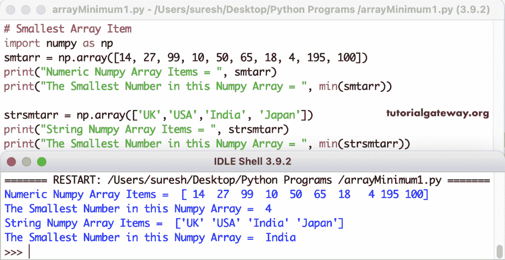

# Python 程序：寻找数组中最小数字

> 原文：<https://www.tutorialgateway.org/python-program-to-find-smallest-number-in-an-array/>

写一个 Python 程序来寻找数组中的最小数。numpy min 函数返回数组中的最小值。我们使用这个 numpy min 函数返回数字和字符串数组中的最小项。

```py
import numpy as np
smtarr = np.array([14, 27, 99, 10, 50, 65, 18, 4, 195, 100])
print("Numeric Numpy Array Items = ", smtarr)
print("The Smallest Number in this Numpy Array = ", min(smtarr))

strsmtarr = np.array(['UK','USA','India', 'Japan'])
print("String Numpy Array Items = ", strsmtarr)
print("The Smallest Number in this Numpy Array = ", min(strsmtarr))
```



## 寻找数组中最小数字的 Python 程序

我们使用 numpy 排序函数对数组进行升序排序，并打印第一个索引位置号，即最小。

```py
import numpy as np
smtarr = np.array([99, 14, 150, 11, 184, 5, 190])
print("Numeric Numpy Array Items = ", smtarr)

print(type(smtarr))
smtarr.sort()
print("The Smallest Number in this Numpy Array = ", smtarr[0])
```

最小数值数组项目输出

```py
Numeric Numpy Array Items =  [ 99  14 150  11 184   5 190]
<class 'numpy.ndarray'>
The Smallest Number in this Numpy Array =  5
```

在这个 Python 示例中，我们将第一个值指定为最小，for 循环范围从 1 开始，遍历到 smtarr 长度减 1。if 条件(if(minist > smtar[I])检查当前 [numpy 数组](https://www.tutorialgateway.org/python-numpy-array/)元素是否大于 minist。如果为真，则将该值(最小= smtarr[I])赋给最小变量，将(位置= i)索引值赋给位置变量。

```py
import numpy as np
smtarr = np.array([14, 27, 99, 10, 50, 65, 18, 4, 195, 100])
print("Numeric Numpy Array Items = ", smtarr)

smallest = smtarr[0]
for i in range(1, len(smtarr)-1) :
    if(smallest > smtarr[i]) :
        smallest = smtarr[i]
        position = i

print("The Smallest Number in this Numpy Array   = ", smallest)
print("The Index Position of the Smallest Number = ", position)
```

蟒阵最小物品输出

```py
Numeric Numpy Array Items =  [ 14  27  99  10  50  65  18   4 195 100]
The Smallest Number in this Numpy Array   =  4
The Index Position of the Smallest Number =  7
```