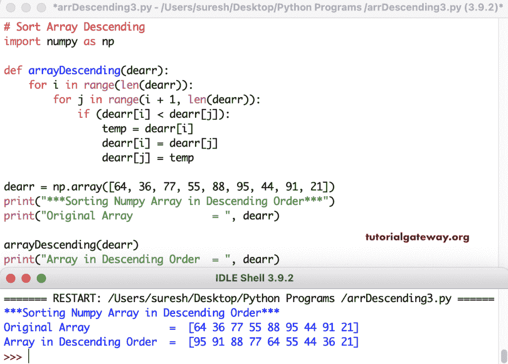

# Python 程序：按降序排序数组

> 原文：<https://www.tutorialgateway.org/python-program-to-sort-array-in-descending-order/>

编写一个 Python 程序，以降序对 Numpy 数组项进行排序。首先，Numpy 排序函数(orarr.sort())按升序对数组项进行排序。接下来，我们使用负值对数组进行切片，以反转数组(descarr = orarr[:-1])，这变成降序。

```py
# Sort Array Descending

import numpy as np

orarr = np.array([22, 98, 77, 88, 35, 15, 122, 91])
print("***Sorting Numpy Array in Descending Order***")
print("Original Array             = ", orarr)

orarr.sort()
descarr = orarr[::-1]
print("Array in Descending Order  = ", descarr)
```

按降序排列 Python Numpy 数组项目输出

```py
***Sorting Numpy Array in Descending Order***
Original Array             =  [ 22  98  77  88  35  15 122  91]
Array in Descending Order  =  [122  98  91  88  77  35  22  15]
```

## 使用 For 循环对数组进行降序排序的 Python 程序。

在这个 Python 示例中，我们使用嵌套循环范围来按降序对 numpy 数组项进行排序。在循环中，if 语句(if(dear[I]< dearr[j])) checks each item is less than other [数组](https://www.tutorialgateway.org/python-numpy-array/)项并将它们赋给 temp 变量。

```py
# Sort Array Descending

import numpy as np

dearr = np.array([11, 46, 22, 89, 77, 98, 55, 181, 65])
print("***Sorting Numpy Array in Descending Order***")
print("Original Array             = ", dearr)

length = len(dearr)

for i in range(length):
    for j in range(i + 1, length):
        if (dearr[i] < dearr[j]):
            temp = dearr[i]
            dearr[i] = dearr[j]
            dearr[j] = temp

print("Array in Descending Order  = ", dearr)
```

使用 for 循环输出按降序对 Python Numpy 数组项进行排序

```py
***Sorting Numpy Array in Descending Order***
Original Array             =  [ 11  46  22  89  77  98  55 181  65]
Array in Descending Order  =  [181  98  89  77  65  55  46  22  11]
```

在这个 Python Numpy Array 示例中，我们创建了一个函数(arrayDescending(dearr))，它按照降序对数组元素进行排序。

```py
# Sort Array Descending

import numpy as np

def arrayDescending(dearr):
    for i in range(len(dearr)):
        for j in range(i + 1, len(dearr)):
            if (dearr[i] < dearr[j]):
                temp = dearr[i]
                dearr[i] = dearr[j]
                dearr[j] = temp

dearr = np.array([64, 36, 77, 55, 88, 95, 44, 91, 21])
print("***Sorting Numpy Array in Descending Order***")
print("Original Array             = ", dearr)

arrayDescending(dearr)
print("Array in Descending Order  = ", dearr)
```

