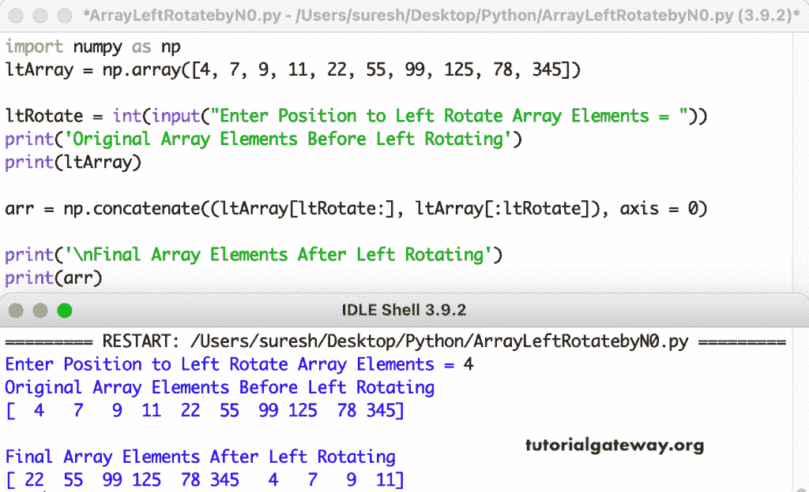

# Python 程序：将 Numpy 数组向左旋转 n

> 原文：<https://www.tutorialgateway.org/python-program-to-left-rotate-a-numpy-array-by-n/>

编写一个 Python 程序，将 Numpy 数组向左旋转 n 次或 n 个位置。为了向左旋转数组，我们根据位置对数组进行了切片，并将其与 Python 示例中的 numpy concatenate 函数相结合。

```py
import numpy as np

ltArray = np.array([4, 7, 9, 11, 22, 55, 99, 125, 78, 345])

ltRotate = int(input("Enter Position to Left Rotate Array Elements = "))

print('Original Array Elements Before Left Rotating')
print(ltArray)

arr = np.concatenate((ltArray[ltRotate:], ltArray[:ltRotate]), axis = 0)

print('\nFinal Array Elements After Left Rotating')
print(arr)
```



这个 Python 程序使用 for 循环根据用户给定的位置向左旋转 Numpy 数组项。

```py
import numpy as np

ltArray = np.array([19, 25, 32, 77, 28, 99, 44, 88])

ltRotate = int(input("Enter Position to Left Rotate Array Elements = "))

print('Original Array Elements Before Left Rotating')
print(ltArray)

for i in range(ltRotate):
    firstValue = ltArray[0]
    for j in range(len(ltArray) - 1):
        ltArray[j] = ltArray[j + 1]
    ltArray[len(ltArray) - 1] = firstValue

print('\nFinal Array Elements After Left Rotating')
print(ltArray)
```

```py
Enter Position to Left Rotate Array Elements = 5
Original Array Elements Before Left Rotating
[19 25 32 77 28 99 44 88]

Final Array Elements After Left Rotating
[99 44 88 19 25 32 77 28]
```

在这个 [Python 例子](https://www.tutorialgateway.org/python-programming-examples/)中，leftRotateArray 函数将把任意数组项旋转到左手边，printArrayItems 打印数组项。

```py
import numpy as np

def printArrayItems(ltArray):
    for i in ltArray:
        print(i, end = ' ')

def leftRotateArray(ltArray, ltRotate):
    for i in range(ltRotate):
        firstValue = ltArray[0]
        for j in range(len(ltArray) - 1):
            ltArray[j] = ltArray[j + 1]
        ltArray[len(ltArray) - 1] = firstValue

ltArray = np.random.randint(11, 110, size = 10)

ltRotate = int(input("\nEnter Position to Left Rotate Array Elements = "))

print('Original Array Elements Before Left Rotating')
printArrayItems(ltArray)

leftRotateArray(ltArray, ltRotate)
print('\nFinal Array Elements After Left Rotating')
printArrayItems(ltArray)
```

```py
Enter Position to Left Rotate Array Elements = 7
Original Array Elements Before Left Rotating
73 45 65 97 84 99 40 18 77 105 
Final Array Elements After Left Rotating
18 77 105 73 45 65 97 84 99 40 
```

Python 程序使用 while 循环向左旋转 Numpy 数组 n。

```py
import numpy as np

def printArrayItems(ltArray):
    i = 0
    while i < len(ltArray):
        print(ltArray[i], end = ' ')
        i = i + 1

def leftRotateArray(ltArray, ltRotate):
    i = 0
    while(i < ltRotate):
        firstValue = ltArray[0]
        j = 0
        while(j < len(ltArray) - 1):
            ltArray[j] = ltArray[j + 1]
            j = j + 1
        ltArray[len(ltArray) - 1] = firstValue
        i = i + 1

ltArray = np.random.randint(70, 500, size = 15)

ltRotate = int(input("\nEnter Position to Left Rotate Array Elements = "))

print('Original Array Elements Before Left Rotating')
printArrayItems(ltArray)

leftRotateArray(ltArray, ltRotate)
print('\nFinal Array Elements After Left Rotating')
printArrayItems(ltArray)
```

```py
Enter Position to Left Rotate Array Elements = 6
Original Array Elements Before Left Rotating
204 76 370 211 180 453 407 250 213 332 456 333 292 460 354 

Final Array Elements After Left Rotating
407 250 213 332 456 333 292 460 354 204 76 370 211 180 453 
```