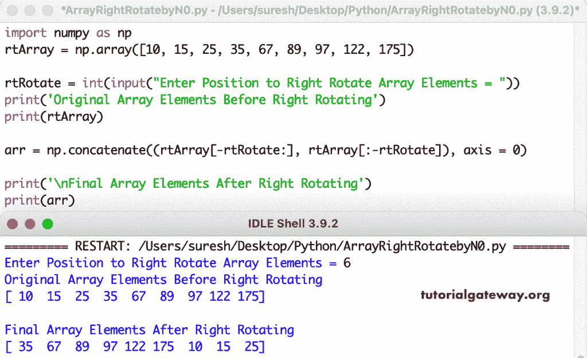

# Python 程序：将 NumPy 数组向右旋转`n`

> 原文：<https://www.tutorialgateway.org/python-program-to-right-rotate-a-numpy-array-by-n/>

编写一个 Python 程序，将 Numpy 数组向右旋转 n 次或`N`个位置。在这个 Python 示例中，我们使用负数从右侧到右侧旋转分割数组，并使用 numpy concatenate 方法合并两个切片。

```py
import numpy as np

rtArray = np.array([10, 15, 25, 35, 67, 89, 97, 122, 175])

rtRotate = int(input("Enter Position to Right Rotate Array Elements = "))

print('Original Array Elements Before Right Rotating')
print(rtArray)

arr = np.concatenate((rtArray[-rtRotate:], rtArray[:-rtRotate]), axis = 0)

print('\nFinal Array Elements After Right Rotating')
print(arr)
```



这个 Python 程序使用嵌套 for 循环将 Numpy 数组项向右旋转用户给定的数字 n 或位置。

```py
import numpy as np

rtArray = np.array([4, 6, 8, 11, 15, 29, 44, 77, 99])

rtRotate = int(input("Enter Position to Right Rotate Array Elements = "))

print('Original Array Elements Before Right Rotating')
print(rtArray)

length = rtArray.size - 1

for i in range(rtRotate):
    lastValue = rtArray[length]
    for j in range(length, -1, -1):
        rtArray[j] = rtArray[j - 1]
    rtArray[0] = lastValue

print('\nFinal Array Elements After Right Rotating')
print(rtArray)
```

```py
Enter Position to Right Rotate Array Elements = 4
Original Array Elements Before Right Rotating
[ 4  6  8 11 15 29 44 77 99]

Final Array Elements After Right Rotating
[29 44 77 99  4  6  8 11 15]
```

在这个 [Python 例子](https://www.tutorialgateway.org/python-programming-examples/)中，RightRotateArray 函数会将数组项旋转到右手边，printRightArrayItems 会打印 numpy 数组项。

```py
import numpy as np

def printRightArrayItems(rtArray):
    for i in rtArray:
        print(i, end = ' ')

def RightRotateArray(rtArray, rtRotate):
    length = rtArray.size - 1

    for i in range(rtRotate):
        lastValue = rtArray[length]

        for j in range(length, -1, -1):
            rtArray[j] = rtArray[j - 1]
        rtArray[0] = lastValue

rtArray = np.random.randint(11, 110, size = 10)

rtRotate = int(input("\nEnter Position to Right Rotate Array Elements = "))

print('Original Array Elements Before Right Rotating')
printRightArrayItems(rtArray)

RightRotateArray(rtArray, rtRotate)
print('\nFinal Array Elements After Right Rotating')
printRightArrayItems(rtArray)
```

```py
Enter Position to Right Rotate Array Elements = 3
Original Array Elements Before Right Rotating
16 63 31 106 18 51 61 35 106 72 
Final Array Elements After Right Rotating
35 106 72 16 63 31 106 18 51 61 
```

Python 程序使用 while 循环向右旋转 Numpy 数组。

```py
import numpy as np

def printRightArrayItems(rtArray):
    i = 0
    while i < len(rtArray):
        print(rtArray[i], end = ' ')
        i = i + 1

def RightRotateArray(rtArray, rtRotate):
    length = rtArray.size - 1
    i = 0
    while(i < rtRotate):
        lastValue = rtArray[length]
        j = length
        while(j >= 0):
            rtArray[j] = rtArray[j - 1]
            j = j - 1
        rtArray[0] = lastValue
        i = i + 1

rtArray = np.random.randint(90, 350, size = 15)

rtRotate = int(input("\nEnter Position to Right Rotate Array Elements = "))

print('Original Array Elements Before Right Rotating')
printRightArrayItems(rtArray)

RightRotateArray(rtArray, rtRotate)
print('\nFinal Array Elements After Right Rotating')
printRightArrayItems(rtArray)
```

```py
Enter Position to Right Rotate Array Elements = 5
Original Array Elements Before Right Rotating
291 249 100 283 189 101 341 333 316 344 285 291 234 336 211 
Final Array Elements After Right Rotating
285 291 234 336 211 291 249 100 283 189 101 341 333 316 344 
```