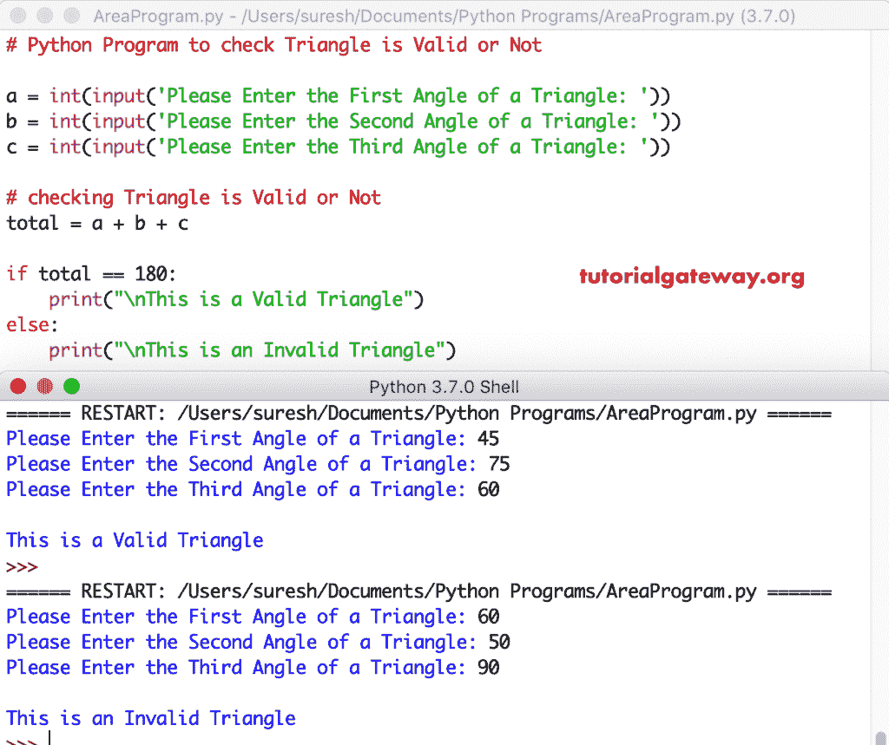

# Python 程序：检查三角形是否有效

> 原文：<https://www.tutorialgateway.org/python-program-to-check-triangle-is-valid-or-not/>

编写一个 Python 程序，使用用户指定的角度检查三角形是否有效。记住，任何三角形都是有效的，如果三角形中 3 个角的和等于 180°

## 检查三角形是否有效的 Python 程序示例 1

这个 python 程序帮助用户输入三角形的所有角度。接下来，我们使用 [If Else 语句](https://www.tutorialgateway.org/python-if-else/)检查给定角度之和是否等于 180°。如果为真，print 语句将打印一个有效的三角形。否则， [python 程序](https://www.tutorialgateway.org/python-programming-examples/)打印为无效三角形。

```py
# Python Program to check Triangle is Valid or Not

a = int(input('Please Enter the First Angle of a Triangle: '))
b = int(input('Please Enter the Second Angle of a Triangle: '))
c = int(input('Please Enter the Third Angle of a Triangle: '))

# checking Triangle is Valid or Not
total = a + b + c

if total == 180:
    print("\nThis is a Valid Triangle")
else:
    print("\nThis is an Invalid Triangle")
```



## 验证三角形是否有效的 Python 程序示例 2

在上面的 [Python](https://www.tutorialgateway.org/python-tutorial/) 例子中，我们忘了检查任何一个角度是否为零。因此，我们使用[逻辑与](https://www.tutorialgateway.org/python-logical-operators/)运算符来确保所有角度都大于 0

```py
a = int(input('Please Enter the First Angle of a Triangle: '))
b = int(input('Please Enter the Second Angle of a Triangle: '))
c = int(input('Please Enter the Third Angle of a Triangle: '))

# checking Triangle is Valid or Not
total = a + b + c

if (total == 180 and a != 0 and b != 0 and c != 0):
    print("\nThis is a Valid Triangle")
else:
    print("\nThis is an Invalid Triangle")
```

```py
Please Enter the First Angle of a Triangle: 70
Please Enter the Second Angle of a Triangle: 70
Please Enter the Third Angle of a Triangle: 40

This is a Valid Triangle
>>> 
=================== RESTART: /Users/suresh/Desktop/simple.py ===================
Please Enter the First Angle of a Triangle: 90
Please Enter the Second Angle of a Triangle: 90
Please Enter the Third Angle of a Triangle: 0

This is an Invalid Triangle
>>>
```