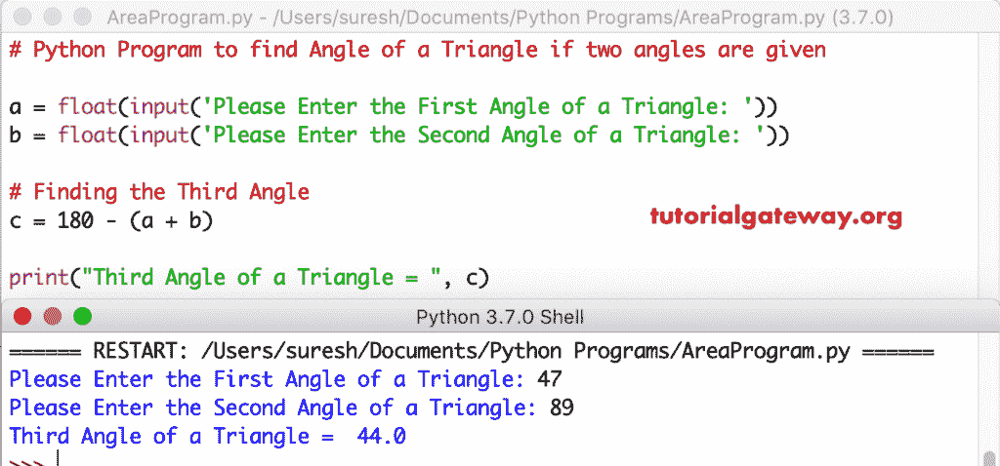

# Python 程序：给定两个角的情况下计算三角形的角

> 原文：<https://www.tutorialgateway.org/python-program-to-find-angle-of-a-triangle-if-two-angles-are-given/>

写一个 Python 程序，如果给出两个角，用一个实例来求三角形的角。

## 如果给出两个角，Python 程序可以找到三角形的角示例 1

这个 python 程序帮助用户输入三角形的两个角度。接下来，我们从 180°减去这两个角度，因为三角形中所有角度的总和= 180°。

```py
# Python Program to find Angle of a Triangle if two angles are given

a = float(input('Please Enter the First Angle of a Triangle: '))
b = float(input('Please Enter the Second Angle of a Triangle: '))

# Finding the Third Angle
c = 180 - (a + b)

print("Third Angle of a Triangle = ", c)
```



## Python 程序使用两个角度查找三角形的角度示例 2

这个 [Python](https://www.tutorialgateway.org/python-tutorial/) 求三角形角度的代码同上。然而，我们使用[函数](https://www.tutorialgateway.org/functions-in-python/)的概念分离了三角形的角度[程序](https://www.tutorialgateway.org/python-programming-examples/)逻辑。

```py
# Python Program to find Angle of a Triangle if two angles are given

def triangle_angle(a, b):
    return 180 - (a + b)

a = float(input('Please Enter the First Angle of a Triangle: '))
b = float(input('Please Enter the Second Angle of a Triangle: '))

# Finding the Third Angle
c = triangle_angle(a, b)
print("Third Angle of a Triangle = ", c)
```

三角形输出的 Python 角度

```py
Please Enter the First Angle of a Triangle: 45
Please Enter the Second Angle of a Triangle: 95
Third Angle of a Triangle =  40.0
```