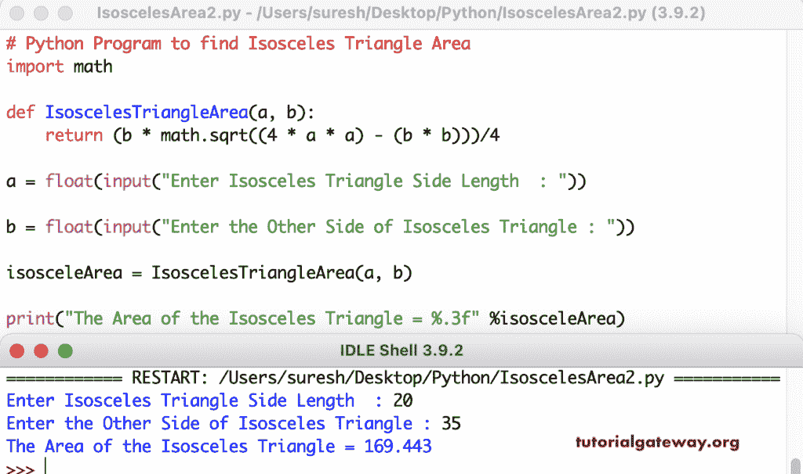

# Python 程序：计算等腰三角形面积

> 原文：<https://www.tutorialgateway.org/python-program-to-find-isosceles-triangle-area/>

写 Python 程序求等腰三角形面积。这个 python 示例允许输入等腰三角形边的长度，并使用数学公式找到该区域。

```py
# Python Program to find Isosceles Triangle Area
import math

a = float(input("Enter Isosceles Triangle SideLength  : "))

b = float(input("Enter the Other Side of Isosceles Triangle : "))

isosceleArea = (b * math.sqrt((4 * a * a) - (b * b)))/4;

print("The Area of the Isosceles Triangle = %.3f" %isosceleArea) 
```

Python 区域的一个 n 等腰三角形输出

```py
Enter Isosceles Triangle SideLength  : 10
Enter the Other Side of Isosceles Triangle : 8
The Area of the Isosceles Triangle = 36.661
```

在这个 Python 程序中，我们创建了一个等值三角形面积函数来寻找等腰三角形的面积。

```py
# Python Program to find Isosceles Triangle Area
import math

def IsoscelesTriangleArea(a, b):
    return (b * math.sqrt((4 * a * a) - (b * b)))/4

a = float(input("Enter Isosceles Triangle Side Length  : "))

b = float(input("Enter the Other Side of Isosceles Triangle : "))

isosceleArea = IsoscelesTriangleArea(a, b)

print("The Area of the Isosceles Triangle = %.3f" %isosceleArea) 
```

