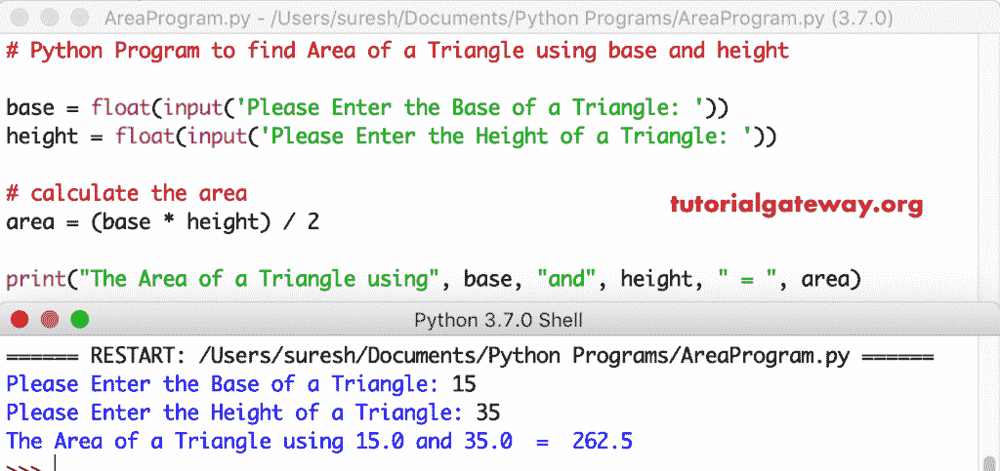

# Python 程序：使用底部和高度计算三角形面积

> 原文：<https://www.tutorialgateway.org/python-program-to-find-area-of-a-triangle-using-base-and-height/>

用一个实际例子编写 Python 程序，用底和高来求三角形的面积。

## 使用底部和高度查找三角形面积的 Python 程序示例 1

这个 Python 程序允许用户输入三角形的底部和高度。通过使用底部和高度值，它可以找到三角形的面积。用底和高求三角形面积的数学公式:面积=(底*高)/ 2。

```py
# Python Program to find Area of a Triangle using base and height

base = float(input('Please Enter the Base of a Triangle: '))
height = float(input('Please Enter the Height of a Triangle: '))

# calculate the area
area = (base * height) / 2

print("The Area of a Triangle using", base, "and", height, " = ", area)
```



## 使用底部和高度计算三角形面积的 Python 程序示例 2

这个 [Python](https://www.tutorialgateway.org/python-tutorial/) 程序对于三角形的面积和上面一样。然而，我们使用 [Python 函数](https://www.tutorialgateway.org/functions-in-python/)概念分离了三角形的区域[程序](https://www.tutorialgateway.org/python-programming-examples/)逻辑。

```py
# Python Program to find Area of a Triangle using base and height
def area_of_triangle(base, height):
    return (base * height) / 2

base = float(input('Please Enter the Base of a Triangle: '))
height = float(input('Please Enter the Height of a Triangle: '))

# calculate the area
area = area_of_triangle(base, height)
print("The Area of a Triangle using", base, "and", height, " = ", area)
```

使用底部和高度输出的三角形的 Python 区域

```py
Please Enter the Base of a Triangle: 35
Please Enter the Height of a Triangle: 85
The Area of a Triangle using 35.0 and 85.0  =  1487.5
```