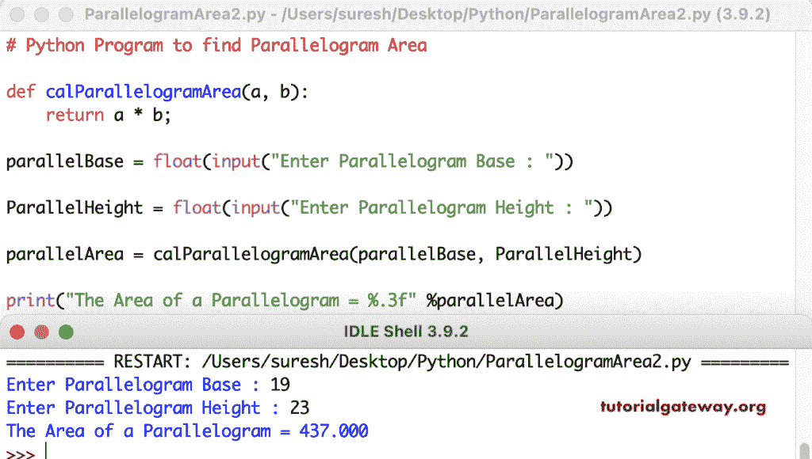

# Python 程序：寻找平行四边形面积

> 原文：<https://www.tutorialgateway.org/python-program-to-find-parallelogram-area/>

写一个 Python 程序，求平行四边形面积。这个 Python 示例允许输入平行四边形的底部和高度，并通过两者相乘来找到面积。

```py
parallelBase = float(input("Enter Parallelogram Base : "))

ParallelHeight = float(input("Enter Parallelogram Height : "))

parallelArea = parallelBase * ParallelHeight

print("The Area of a Parallelogram = %.3f" %parallelArea) 
```

```py
Enter Parallelogram Base : 20
Enter Parallelogram Height : 32
The Area of a Parallelogram = 640.000
```

在这个 Python 程序中，我们提供了一个计算平行四边形面积的函数。

```py
def calParallelogramArea(a, b):
    return a * b;

parallelBase = float(input("Enter Parallelogram Base : "))

ParallelHeight = float(input("Enter Parallelogram Height : "))

parallelArea = calParallelogramArea(parallelBase, ParallelHeight)

print("The Area of a Parallelogram = %.3f" %parallelArea) 
```

