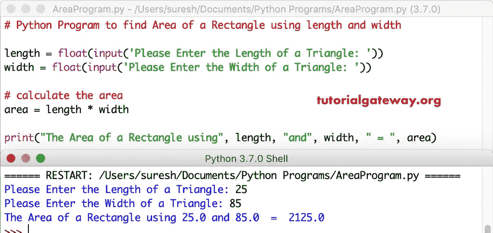

# Python 程序：计算长度和宽度查找矩形面积

> 原文：<https://www.tutorialgateway.org/python-program-to-find-area-of-a-rectangle-using-length-and-width/>

用一个实际例子编写 Python 程序，利用长度和宽度找到矩形的面积。

## 使用长度和宽度查找矩形面积的 Python 程序示例 1

这个 Python 程序允许用户输入矩形的长度和宽度。使用这两个值，它可以找到矩形的面积。如果我们知道矩形的长度和宽度。计算矩形面积的数学公式是:面积=长度*宽度。

```py
# Python Program to find Area of a Rectangle using length and width

length = float(input('Please Enter the Length of a Triangle: '))
width = float(input('Please Enter the Width of a Triangle: '))

# calculate the area
area = length * width

print("The Area of a Rectangle using", length, "and", width, " = ", area)
```



## 使用长度和宽度计算矩形面积的 Python 程序示例 2

这个 [Python](https://www.tutorialgateway.org/python-tutorial/) 代码查找矩形的面积同上。然而，我们使用[函数](https://www.tutorialgateway.org/functions-in-python/)的概念分离了 [python 程序](https://www.tutorialgateway.org/python-programming-examples/)的逻辑。

```py
# Python Program to find Area of a Rectangle using length and width

def area_of_Rectangle(length, width):
    return length * width
length = float(input('Please Enter the Length of a Triangle: '))
width = float(input('Please Enter the Width of a Triangle: '))

# calculate the area of a Rectangle
area = area_of_Rectangle(length, width)

print("The Area of a Rectangle using", length, "and", width, " = ", area)
```

```py
Please Enter the Length of a Triangle: 125
Please Enter the Width of a Triangle: 65
The Area of a Rectangle using 125.0 and 65.0  =  8125.0
```