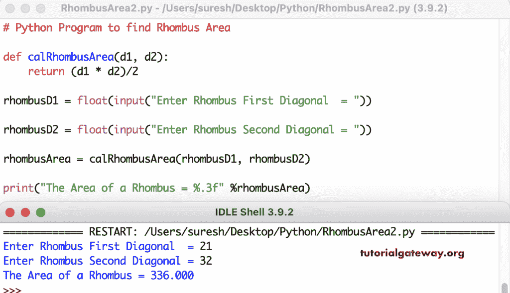

# Python 程序：计算菱形面积

> 原文：<https://www.tutorialgateway.org/python-program-to-find-rhombus-area/>

写一个 Python 程序，用一个例子找到菱形的面积。这个 Python 示例允许菱形第一和第二对角线，并计算菱形面积。

```py
# Python Program to find Rhombus Area

rhombusD1 = float(input("Enter Rhombus First Diagonal  = "))

rhombusD2 = float(input("Enter Rhombus Second Diagonal = "))

rhombusArea = (rhombusD1 * rhombusD2)/2

print("The Area of a Rhombus = %.3f" %rhombusArea) 
```

蟒菱区输出

```py
Enter Rhombus First Diagonal  = 25
Enter Rhombus Second Diagonal = 28
The Area of a Rhombus = 350.000
```

在这个 Python 程序中，我们创建了一个 cal 菱形面积函数来寻找菱形面积。

```py
# Python Program to find Rhombus Area

def calRhombusArea(d1, d2):
    return (d1 * d2)/2

rhombusD1 = float(input("Enter Rhombus First Diagonal  = "))

rhombusD2 = float(input("Enter Rhombus Second Diagonal = "))

rhombusArea = calRhombusArea(rhombusD1, rhombusD2)

print("The Area of a Rhombus = %.3f" %rhombusArea) 
```

