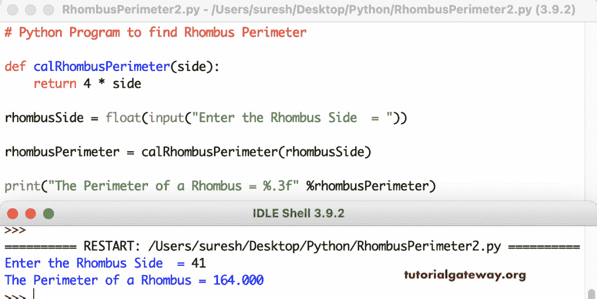

# Python 程序：寻找菱形周长

> 原文：<https://www.tutorialgateway.org/python-program-to-find-rhombus-perimeter/>

写一个 Python 程序，用一个例子找到菱形的周长。这个 Python 示例允许菱形边并计算菱形周长。

```py
# Python Program to find Rhombus Perimeter

rhombusSide = float(input("Enter the Rhombus Side  = "))

rhombusPerimeter = 4 * rhombusSide

print("The Perimeter of a Rhombus = %.3f" %rhombusPerimeter) 
```

```py
Enter the Rhombus Side  = 23
The Perimeter of a Rhombus = 92.000
```

在这个 Python 程序中，cal 菱形周长计函数查找并返回菱形周长。

```py
# Python Program to find Rhombus Perimeter

def calRhombusPerimeter(side):
    return 4 * side

rhombusSide = float(input("Enter the Rhombus Side  = "))

rhombusPerimeter = calRhombusPerimeter(rhombusSide)

print("The Perimeter of a Rhombus = %.3f" %rhombusPerimeter) 
```

