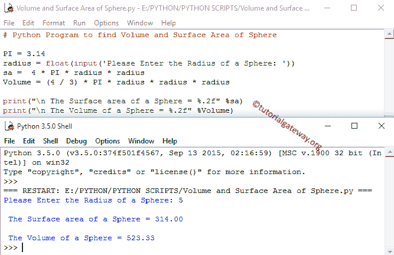

# Python 程序：计算球体体积和表面积

> 原文：<https://www.tutorialgateway.org/python-program-to-find-volume-and-surface-area-of-sphere/>

如何用例子编写 Python 程序求球体的体积和表面积？在我们进入 Python 程序寻找球体的体积和表面积之前，让我们看看定义和公式

## 球体的 Python 表面积

球体看起来像一个篮球，或者我们可以说是一个圆的三维视图。如果我们知道球体的半径，那么我们可以用公式计算球体的表面积:

球体的表面积= 4πr(其中 r 是球体的半径)。

根据上面的公式，如果我们知道球体的表面积，那么我们可以使用以下公式计算球体的半径:

球面半径= √sa / 4π(其中 sa 是球面的表面积)。

### 球体的 Python 体积

球体内部的空间量称为体积。如果我们知道球体的半径，那么我们可以用公式计算球体的体积:

球体的体积= 4πr

## 寻找球体体积和表面积的 Python 程序

我们将 pi 定义为全局变量，赋值为 3.14。这个 python 程序允许用户输入半径值，然后根据公式计算球体的表面积和体积。

```py
# Python Program to find Volume and Surface Area of Sphere

PI = 3.14
radius = float(input('Please Enter the Radius of a Sphere: '))
sa =  4 * PI * radius * radius
Volume = (4 / 3) * PI * radius * radius * radius

print("\n The Surface area of a Sphere = %.2f" %sa)
print("\n The Volume of a Sphere = %.2f" %Volume)
```



在这个寻找球体体积和表面积的 Python 程序中，我们输入了球体半径= 5

球体的表面积是

表面积= 4πr
表面积= 4 *π*半径*半径；
表面积= 4 * 3.14 * 5 * 5
表面积= 314

球体的体积是

体积= 4πr
体积=(4.0/3)*π*半径*半径*半径；
体积=(4.0/3)* 3.14 * 5 * 5 * 5；
卷= 523.33333

让我们用表面积来计算球体的半径:

在上面的 [Python](https://www.tutorialgateway.org/python-tutorial/) 示例中，当半径= 5 时，我们得到了球体的表面积= 314。让我们做相反的方法(从表面积计算半径= 5)

球体半径= √sa / 4π
球体半径= √314 / 4 * 3.14
球体半径= √314 / 12.56
球体半径= √25
球体半径= 5

## 用函数求球体体积和表面积的 Python 程序

这个 [python 程序](https://www.tutorialgateway.org/python-programming-examples/)允许用户输入半径值。我们将半径值传递给函数参数，然后它将根据公式计算球体的表面积和体积。

```py
# Python Program to find Volume and Surface Area of Sphere using Functions

import math

def Area_of_Triangle(radius):
    sa =  4 * math.pi * radius * radius
    Volume = (4 / 3) * math.pi * radius * radius * radius
    print("\n The Surface area of a Sphere = %.2f" %sa)
    print("\n The Volume of a Sphere = %.2f" %Volume)

Area_of_Triangle(6)
```

球体输出的 Python 表面积和体积

```py
 The Surface area of a Sphere = 452.39

 The Volume of a Sphere = 904.78
>>> Area_of_Triangle(11)

 The Surface area of a Sphere = 1520.53

 The Volume of a Sphere = 5575.28
>>> 
```

在这个寻找球体体积和表面积的 Python 程序中，首先，我们使用以下语句导入了数学库。这将允许我们使用数学函数，比如 math.pi

```py
import math
```

第二步:接下来，我们使用 def 关键字用一个参数定义函数。这意味着，用户将输入一个球体的半径。

第三步:根据公式计算球体的表面积和体积

注意:在放置开括号和闭括号时请小心，如果放置错误，可能会改变整个计算