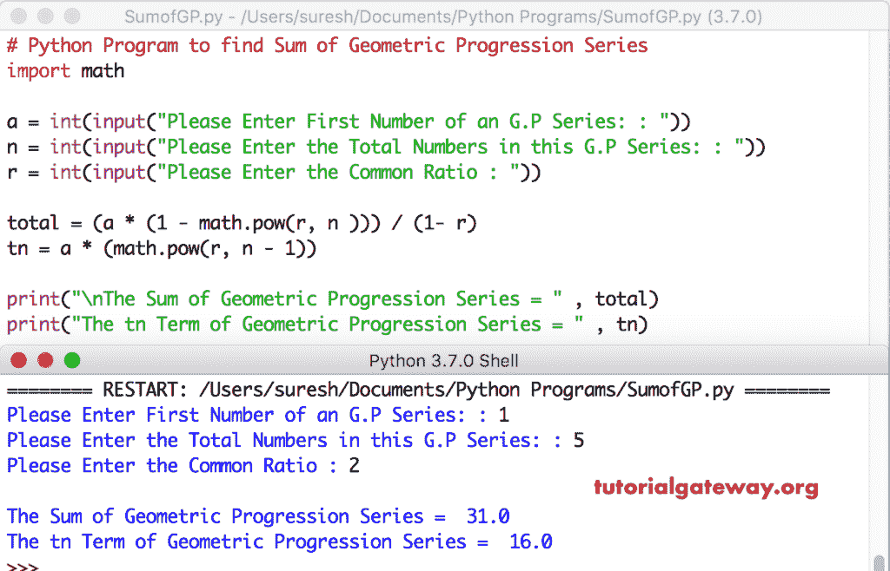

# Python 程序：寻找几何级数和

> 原文：<https://www.tutorialgateway.org/python-program-to-find-sum-of-geometric-progression-series/>

写一个 Python 程序，用实例求几何级数(G.P .级数)的和。

## Python 通用编程系列

几何级数是一个元素序列，其中下一个项目通过乘以上一个项目的公约数而获得。或者 G.P. Series 是一系列数字，其中任何连续数字(项目)的公共比率总是相同的。

G.P 系列之和
Sn = a(r<sup>n</sup>)/(1-r)
Tn = ar<sup>(n-1)</sup>背后的数学公式

## Python 程序求几何级数和的例子

这个 Python 程序允许用户输入第一个值、一系列项目的总数和公共定额。接下来，它找到几何级数的和。

```py
# Python Program to find Sum of Geometric Progression Series
import math

a = int(input("Please Enter First Number of an G.P Series: : "))
n = int(input("Please Enter the Total Numbers in this G.P Series: : "))
r = int(input("Please Enter the Common Ratio : "))

total = (a * (1 - math.pow(r, n ))) / (1- r)
tn = a * (math.pow(r, n - 1))

print("\nThe Sum of Geometric Progression Series = " , total)
print("The tn Term of Geometric Progression Series = " , tn)
```



## 不用数学公式求几何级数和的程序

在这个 [Python](https://www.tutorialgateway.org/python-tutorial/) 程序中，我们没有使用任何数学公式。

```py
# Python Program to find Sum of Geometric Progression Series

a = int(input("Please Enter First Number of an G.P Series: : "))
n = int(input("Please Enter the Total Numbers in this G.P Series: : "))
r = int(input("Please Enter the Common Ratio : "))

total = 0
value = a
print("\nG.P  Series :", end = " ")
for i in range(n):
    print("%d  " %value, end = " ")
    total = total + value
    value = value * r

print("\nThe Sum of Geometric Progression Series = " , total)
```

几何级数输出的 Python 和

```py
Please Enter First Number of an G.P Series: : 1
Please Enter the Total Numbers in this G.P Series: : 5
Please Enter the Common Ratio : 4

G.P  Series : 1   4   16   64   256   
The Sum of Geometric Progression Series =  341
```

## 用函数计算几何级数和的 Python 程序

这个 Python 几何级数程序与第一个示例相同。然而，在这个 [Python 程序](https://www.tutorialgateway.org/python-programming-examples/)中，我们使用[函数](https://www.tutorialgateway.org/functions-in-python/)来分离逻辑。

```py
# Python Program to find Sum of Geometric Progression Series
import math

def sumofGP(a, n, r):
    total = (a * (1 - math.pow(r, n ))) / (1- r)
    return total

a = int(input("Please Enter First Number of an G.P Series: : "))
n = int(input("Please Enter the Total Numbers in this G.P Series: : "))
r = int(input("Please Enter the Common Ratio : "))

total = sumofGP(a, n, r)
print("\nThe Sum of Geometric Progression Series = " , total)
```

宝洁系列输出的 Python 和

```py
Please Enter First Number of an G.P Series: : 2
Please Enter the Total Numbers in this G.P Series: : 6
Please Enter the Common Ratio : 3

The Sum of Geometric Progression Series =  728.0
```