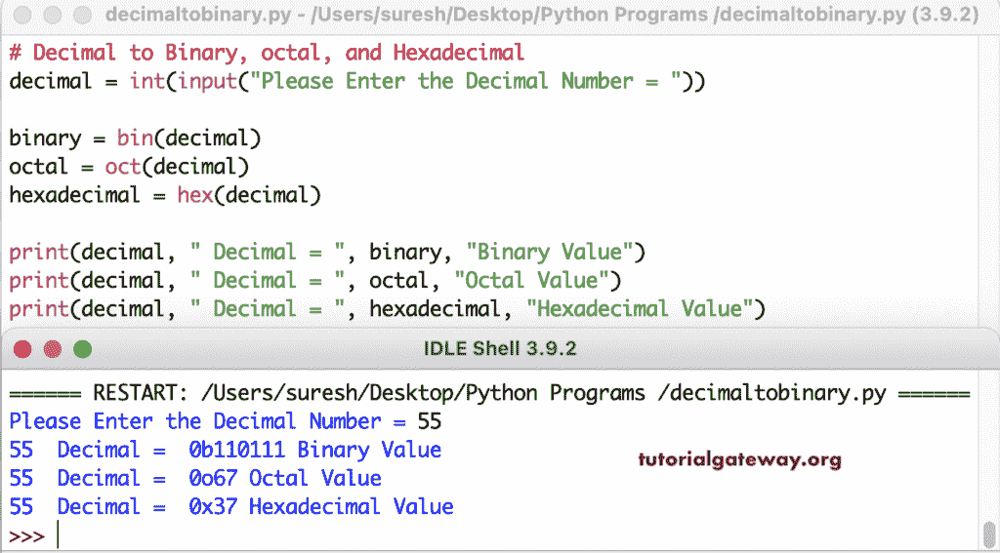

# Python 程序：将十进制转换为二进制、八进制和十六进制

> 原文：<https://www.tutorialgateway.org/python-program-to-convert-decimal-to-binary-octal-and-hexadecimal/>

写一个 Python 程序将十进制转换为二进制、八进制和十六进制，并举例说明。在这个 Python 示例中，我们使用了 bin(转换为二进制)、oct(用于八进制)和 hex(用于十六进制)函数。

```py
decimal = int(input("Please Enter the Decimal Number = "))

binary = bin(decimal)
octal = oct(decimal)
hexadecimal = hex(decimal)

print(decimal, " Decimal = ", binary, "Binary Value")
print(decimal, " Decimal = ", octal, "Octal Value")
print(decimal, " Decimal = ", hexadecimal, "Hexadecimal Value")
```

