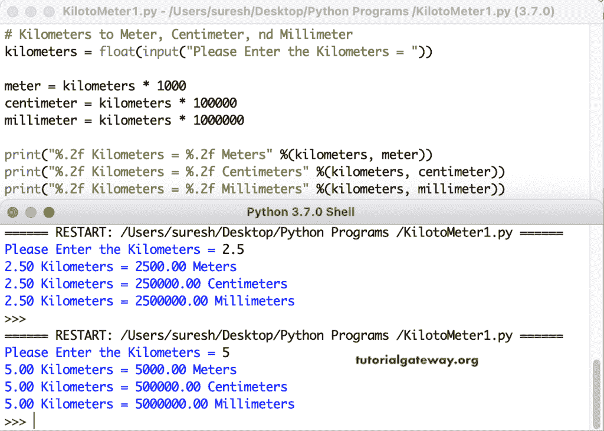

# Python 程序：将公里转换为米厘米和毫米

> 原文：<https://www.tutorialgateway.org/python-program-to-convert-kilometers-to-meters-centimeters-and-millimeters/>

编写一个 Python 程序，将公里转换为米、厘米和毫米。这个 Python 示例允许插入公里，并将它们转换为米、毫米和厘米。我们知道，一公里等于 1000 米，100000 厘米，1000000 毫米。

```py
# Kilometers to Meter, Centimeter, and Millimeter

kilometers = float(input("Please Enter the Kilometers = "))

meter = kilometers * 1000
centimeter = kilometers * 100000
millimeter = kilometers * 1000000

print("%.2f Kilometers = %.2f Meters" %(kilometers, meter))
print("%.2f Kilometers = %.2f Centimeters" %(kilometers, centimeter))
print("%.2f Kilometers = %.2f Millimeters" %(kilometers, millimeter))
```

