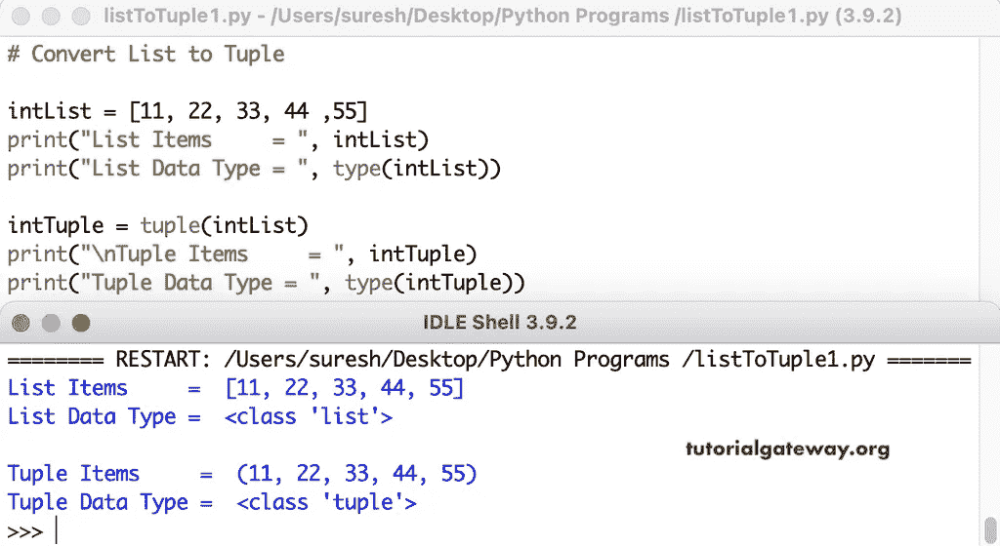

# Python 程序：将列表转换为元组

> 原文：<https://www.tutorialgateway.org/python-program-to-convert-list-to-tuple/>

写一个 Python 程序将列表转换成元组。在 Python 中，我们有一个元组函数，它将列表项转换为元组。这个 Python 示例使用元组函数将列表转换为元组。

```py
intList = [11, 22, 33, 44 ,55]
print("List Items     = ", intList)
print("List Data Type = ", type(intList))

intTuple = tuple(intList)
print("\nTuple Items     = ", intTuple)
print("Tuple Data Type = ", type(intTuple))
```



## 将列表转换为元组的 Python 程序示例 2

它允许用户输入列表项，并使用不同的选项将该列表转换为元组。

```py
list1 = []

number = int(input("Enter the Total List Items = "))
for i in range(1, number + 1):
    value = int(input("Enter the %d List value = " %i))
    list1.append(value)

print("List Items     = ", list1)
print("List Data Type = ", type(list1))

intTuple = tuple(list1)
print("\nTuple Items     = ", intTuple)
print("Tuple Data Type = ", type(intTuple))

intTuple1 = (*list1,)
print("\nTuple Items     = ", intTuple1)
print("Tuple Data Type = ", type(intTuple1))
```

```py
Enter the Total List Items = 4
Enter the 1 List value = 20
Enter the 2 List value = 50
Enter the 3 List value = 120
Enter the 4 List value = 90
List Items     =  [20, 50, 120, 90]
List Data Type =  <class 'list'>

Tuple Items     =  (20, 50, 120, 90)
Tuple Data Type =  <class 'tuple'>

Tuple Items     =  (20, 50, 120, 90)
Tuple Data Type =  <class 'tuple'>
```