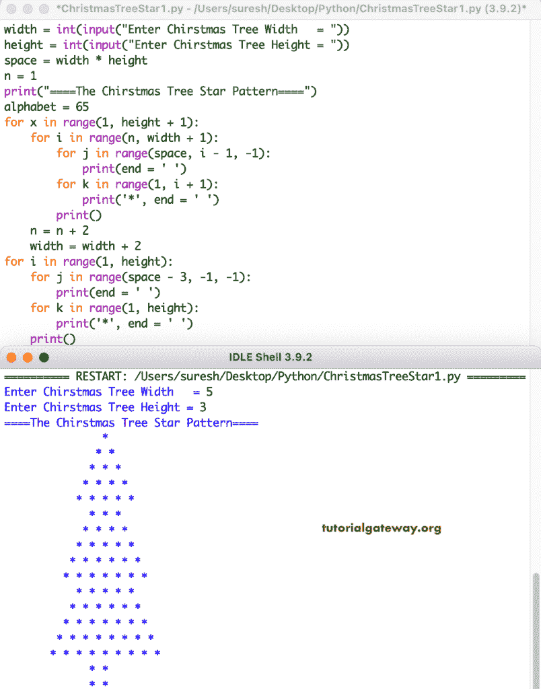

# Python 程序：打印星号的圣诞树图案

> 原文：<https://www.tutorialgateway.org/python-program-to-print-christmas-tree-star-pattern/>

编写一个 Python 程序，使用 for 循环打印星号的圣诞树图案。

```py
width = int(input("Enter Chirstmas Tree Width   = "))
height = int(input("Enter Chirstmas Tree Height = "))

space = width * height
n = 1

print("====The Chirstmas Tree Star Pattern====")
alphabet = 65

for x in range(1, height + 1):
    for i in range(n, width + 1):
        for j in range(space, i - 1, -1):
            print(end = ' ')
        for k in range(1, i + 1):
            print('*', end = ' ')
        print()
    n = n + 2
    width = width + 2

for i in range(1, height):
    for j in range(space - 3, -1, -1):
        print(end = ' ')
    for k in range(1, height):
        print('*', end = ' ')
    print()

```



这个 [Python 示例](https://www.tutorialgateway.org/python-programming-examples/)使用 while 循环打印星星的圣诞树图案。

```py
width = int(input("Enter Christmas Tree Width   = "))
height = int(input("Enter Christmas Tree Height = "))

space = width * height
n = 1

print("====The Christmas Tree Star Pattern====")
alphabet = 65
x = 1

while(x <= height):
    i = n
    while(i <= width):
        j = space
        while(j >= i):
            print(end = ' ')
            j = j - 1
        k = 1
        while(k <= i):
            print('*', end = ' ')
            k = k + 1
        print()
        i = i + 1
    n = n + 2
    width = width + 2
    x = x + 1

i = 1
while(i < height):
    j = space - 3
    while(j >= 0):
        print(end = ' ')
        j = j - 1
    k = 1
    while(k < height):
        print('*', end = ' ')
        k = k + 1
    print()
    i = i + 1
```

```py
Enter Christmas Tree Width   = 7
Enter Christmas Tree Height = 5
====The Christmas Tree Star Pattern====
                                   * 
                                  * * 
                                 * * * 
                                * * * * 
                               * * * * * 
                              * * * * * * 
                             * * * * * * * 
                                 * * * 
                                * * * * 
                               * * * * * 
                              * * * * * * 
                             * * * * * * * 
                            * * * * * * * * 
                           * * * * * * * * * 
                               * * * * * 
                              * * * * * * 
                             * * * * * * * 
                            * * * * * * * * 
                           * * * * * * * * * 
                          * * * * * * * * * * 
                         * * * * * * * * * * * 
                             * * * * * * * 
                            * * * * * * * * 
                           * * * * * * * * * 
                          * * * * * * * * * * 
                         * * * * * * * * * * * 
                        * * * * * * * * * * * * 
                       * * * * * * * * * * * * * 
                           * * * * * * * * * 
                          * * * * * * * * * * 
                         * * * * * * * * * * * 
                        * * * * * * * * * * * * 
                       * * * * * * * * * * * * * 
                      * * * * * * * * * * * * * * 
                     * * * * * * * * * * * * * * * 
                                 * * * * 
                                 * * * * 
                                 * * * * 
                                 * * * * 
```