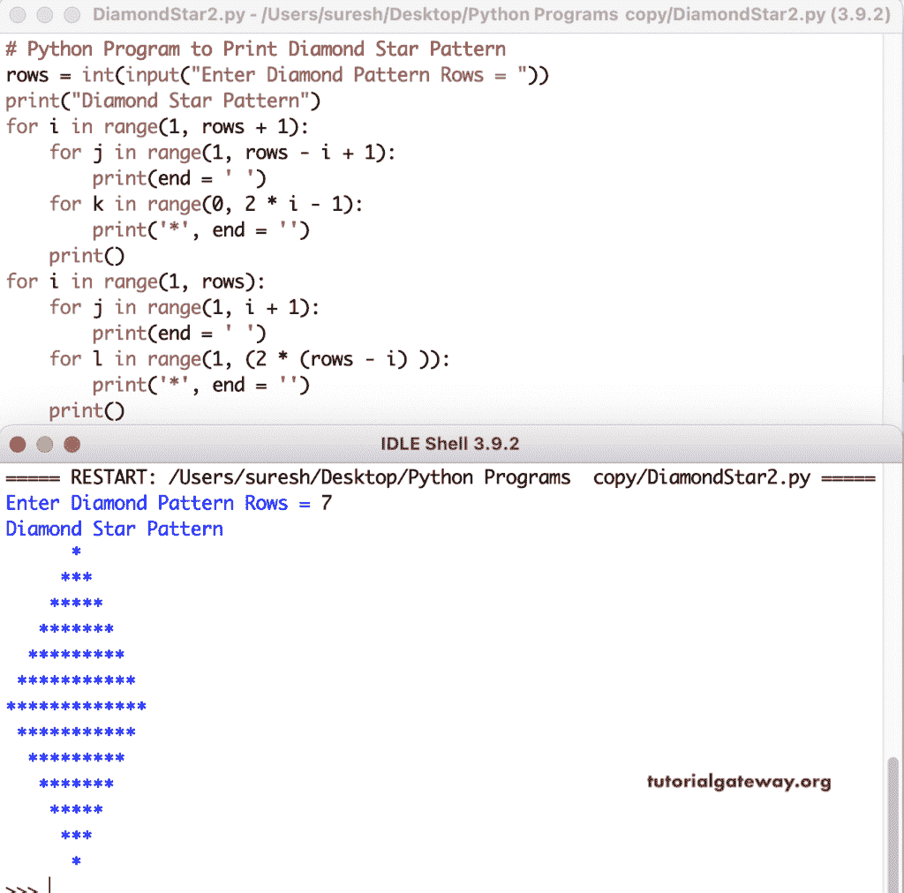

# Python 程序：打印钻石星形图案

> 原文：<https://www.tutorialgateway.org/python-program-to-print-diamond-star-pattern/>

写一个 Python 程序来打印菱形星形图案，用于循环。

```py
# Python Program to Print Diamond Star Pattern

rows = int(input("Enter Diamond Pattern Rows = "))

print("Diamond Star Pattern") 
k = 0
for i in range(1, rows + 1):
    for j in range(1, rows - i + 1):
        print(end = ' ')
    while k != 2 * i - 1:
        print('*', end = '')
        k = k + 1
    k = 0
    print()

k = 2
l = 1
for i in range(1, rows):
    for j in range(1, k):
        print(end = ' ')
    k = k + 1
    while l <= (2 * (rows - i) - 1):
        print('*', end = '')
        l = l + 1
    l = 1
    print()
```

```py
Enter Diamond Pattern Rows = 8
Diamond Star Pattern
       *
      ***
     *****
    *******
   *********
  ***********
 *************
***************
 *************
  ***********
   *********
    *******
     *****
      ***
       *
>>> 
```

我们修改了上面的 Python 程序，并将 while 循环替换为 for 循环来打印菱形星形图案。

```py
# Python Program to Print Diamond Star Pattern

rows = int(input("Enter Diamond Pattern Rows = "))

print("Diamond Star Pattern") 
for i in range(1, rows + 1):
    for j in range(1, rows - i + 1):
        print(end = ' ')
    for k in range(0, 2 * i - 1):
        print('*', end = '')
    print()

for i in range(1, rows):
    for j in range(1, i + 1):
        print(end = ' ')
    for l in range(1, (2 * (rows - i) )):
        print('*', end = '')
    print()
```



在这个 Python 程序中，我们创建了一个钻石图案函数，它接受行和符号来打印钻石图案。这个标志将代替钻石图案的星星。

```py
# Python Program to Print Diamond Star Pattern

def  diamondPattern(rows, ch):
    for i in range(1, rows + 1):
        for j in range(1, rows - i + 1):
            print(end = ' ')
        for k in range(0, 2 * i - 1):
            print('%c' %ch, end = '')
        print()

    for i in range(1, rows):
        for j in range(1, i + 1):
            print(end = ' ')
        for k in range(1, (2 * (rows - i))):
            print('%c' %ch, end = '')
        print()

rows = int(input("Enter Diamond Pattern Rows = "))

ch = input("Symbol to Print in Diamond Pattern = ")

print("Diamond Pattern")
diamondPattern(rows, ch)
```

```py
Enter Diamond Pattern Rows = 10
Symbol to Print in Diamond Pattern = ^
Diamond Pattern
         ^
        ^^^
       ^^^^^
      ^^^^^^^
     ^^^^^^^^^
    ^^^^^^^^^^^
   ^^^^^^^^^^^^^
  ^^^^^^^^^^^^^^^
 ^^^^^^^^^^^^^^^^^
^^^^^^^^^^^^^^^^^^^
 ^^^^^^^^^^^^^^^^^
  ^^^^^^^^^^^^^^^
   ^^^^^^^^^^^^^
    ^^^^^^^^^^^
     ^^^^^^^^^
      ^^^^^^^
       ^^^^^
        ^^^
         ^
>>> 
```