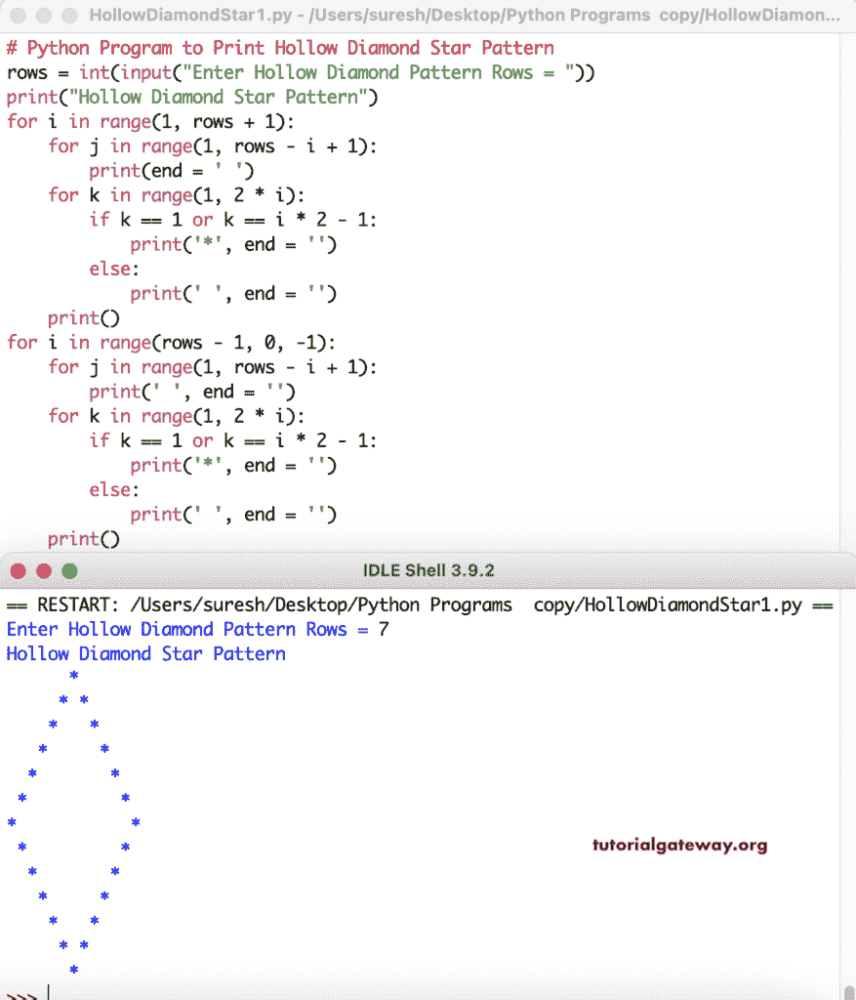

# Python 程序：打印星号的空心菱形图案

> 原文：<https://www.tutorialgateway.org/python-program-to-print-hollow-diamond-star-pattern/>

写一个 Python 程序来打印星号的空心菱形图案，用于循环。这个 Python 示例使用嵌套的 for 循环和 if-else 来返回空心菱形图案。

```py
# Python Program to Print Hollow Diamond Star Pattern

rows = int(input("Enter Hollow Diamond Pattern Rows = "))

print("Hollow Diamond Star Pattern") 
for i in range(1, rows + 1):
    for j in range(1, rows - i + 1):
        print(end = ' ')
    for k in range(1, 2 * i):
        if k == 1 or k == i * 2 - 1:
            print('*', end = '')
        else:
            print(' ', end = '')
    print()

for i in range(rows - 1, 0, -1):
    for j in range(1, rows - i + 1):
        print(' ', end = '')
    for k in range(1, 2 * i):
        if k == 1 or k == i * 2 - 1:
            print('*', end = '')
        else:
            print(' ', end = '')
    print()
```



在这个 Python 程序中，我们创建了一个 hollowDiamondStar 函数来打印空心菱形图案。给定的符号将代替空心菱形图案中的星星。

```py
def hollowDiamondStar(rows, ch):
    for i in range(1, rows + 1):
        for j in range(1, rows - i + 1):
            print(end = ' ')
        for k in range(1, 2 * i):
            if k == 1 or k == i * 2 - 1:
                print('%c' %ch, end = '')
            else:
                print(' ', end = '')
        print()

    for i in range(rows - 1, 0, -1):
        for j in range(1, rows - i + 1):
            print(' ', end = '')
        for k in range(1, 2 * i):
            if k == 1 or k == i * 2 - 1:
                print('%c' %ch, end = '')
            else:
                print(' ', end = '')
        print()

rows = int(input("Enter Hollow Diamond Pattern Rows = "))

ch = input("Symbol to use in Hollow Diamond Pattern = ")

print("Hollow Diamond Star Pattern")
hollowDiamondStar(rows, ch)
```

```py
Enter Hollow Diamond Pattern Rows = 12
Symbol to use in Hollow Diamond Pattern = $
Hollow Diamond Star Pattern
           $
          $ $
         $   $
        $     $
       $       $
      $         $
     $           $
    $             $
   $               $
  $                 $
 $                   $
$                     $
 $                   $
  $                 $
   $               $
    $             $
     $           $
      $         $
       $       $
        $     $
         $   $
          $ $
           $
>>> 
```