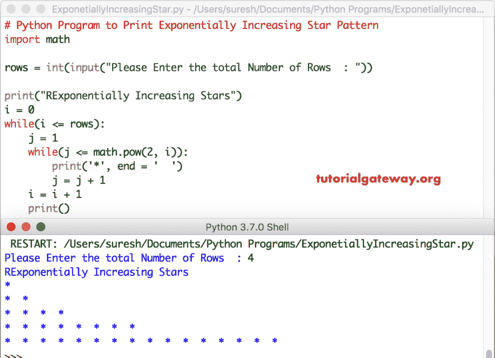

# Python 程序：打印星号的指数增长图案

> 原文：<https://www.tutorialgateway.org/python-program-to-print-exponentially-increasing-star-pattern/>

写一个 Python 程序，使用 For 循环和 While 循环打印星号的指数增长的图案，并举例说明。

## 使用 While 循环打印星号的指数增长图案的 Python 程序

这个 Python 程序允许用户输入总行数。接下来，我们使用 Python 嵌套 While 循环来打印从 1 到用户指定的最大值(行)的指数级星号增长。

```py
# Python Program to Print Exponentially Increasing Star Pattern
import math

rows = int(input("Please Enter the total Number of Rows  : "))

print("Exponentially Increasing Stars") 
i = 0
while(i <= rows):
    j = 1
    while(j <= math.pow(2, i)):        
        print('*', end = '  ')
        j = j + 1
    i = i + 1
    print()
```



## 使用 For 循环打印指数增长星号的 Python 程序

这个指数增长模式的恒星计划与第一个例子相同。但是，我们将 [While Loop](https://www.tutorialgateway.org/python-while-loop/) 替换为 [For Loop](https://www.tutorialgateway.org/python-for-loop/) 。

```py
# Python Program to Print Exponentially Increasing Star Pattern
import math

rows = int(input("Please Enter the total Number of Rows  : "))

print("Exponentially Increasing Stars") 
for i in range(rows + 1):
    for j in range(1, int(math.pow(2, i) + 1)):        
        print('*', end = '  ')
    print()
```

```py
Please Enter the total Number of Rows  : 3
Exponentially Increasing Stars
*  
*  *  
*  *  *  *  
*  *  *  *  *  *  *  *  
>>> 
```

## 打印指数增长的星星的 Python 程序示例 2

这个 [Python 程序](https://www.tutorialgateway.org/python-programming-examples/)允许用户输入他/她的角色。接下来， [Python](https://www.tutorialgateway.org/python-tutorial/) 打印用户指定字符的指数增长模式。

```py
# Python Program to Print Exponentially Increasing Star Pattern
import math

rows = int(input("Please Enter the total Number of Rows  : "))
ch = input("Please Enter any Character  : ")

print("Exponentially Increasing Stars") 
for i in range(rows + 1):
    for j in range(1, int(math.pow(2, i) + 1)):        
        print('%c' %ch, end = '  ')
    print()
```

```py
Please Enter the total Number of Rows  : 4
Please Enter any Character  : #
Exponentially Increasing Stars
#  
#  #  
#  #  #  #  
#  #  #  #  #  #  #  #  
#  #  #  #  #  #  #  #  #  #  #  #  #  #  #  #  
>>> 
```