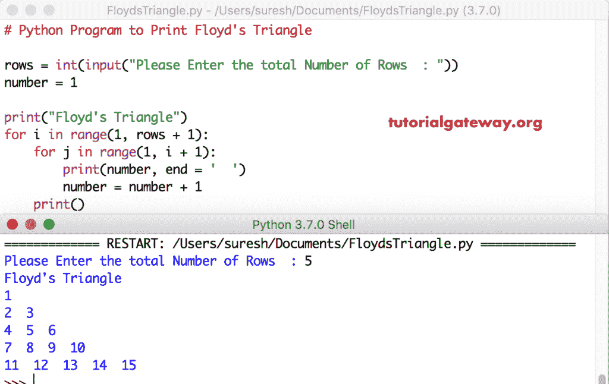

# Python 程序：打印弗洛伊德三角形

> 原文：<https://www.tutorialgateway.org/python-program-to-print-floyds-triangle/>

写一个 Python 程序，用 For 循环和 While 循环打印弗洛伊德的三角形，并举例说明。

## 用 For 循环打印弗洛伊德三角形的 Python 程序

这个 Python 程序允许用户输入总行数。接下来，我们使用 Python 嵌套 For 循环打印弗洛伊德的三角形图案，从 1 到用户指定的行。

```py
# Python Program to Print Floyd's Triangle

rows = int(input("Please Enter the total Number of Rows  : "))
number = 1

print("Floyd's Triangle") 
for i in range(1, rows + 1):
    for j in range(1, i + 1):        
        print(number, end = '  ')
        number = number + 1
    print()
```



## 用 While 循环实现弗洛伊德三角形的 Python 程序

这个泛三角的数字[程序](https://www.tutorialgateway.org/python-programming-examples/)同上。然而，我们将[换成了](https://www.tutorialgateway.org/python-for-loop/)[同时换成了](https://www.tutorialgateway.org/python-while-loop/)

```py
# Python Program to Print Floyd's Triangle

rows = int(input("Please Enter the total Number of Rows  : "))
number = 1

print("Floyd's Triangle")
i = 1
while(i <= rows):
    j = 1
    while(j <= i):        
        print(number, end = '  ')
        number = number + 1
        j = j + 1
    i = i + 1
    print()
```

Python Floyds 三角形使用 while 循环输出

```py
Please Enter the total Number of Rows  : 10
Floyd's Triangle
1  
2  3  
4  5  6  
7  8  9  10  
11  12  13  14  15  
16  17  18  19  20  21  
22  23  24  25  26  27  28  
29  30  31  32  33  34  35  36  
37  38  39  40  41  42  43  44  45  
46  47  48  49  50  51  52  53  54  55  
>>> 
```

## 显示弗洛伊德三角形的 Python 程序示例

这个 [Python](https://www.tutorialgateway.org/python-tutorial/) 程序以弗洛伊德三角模式返回星星。

```py
# Python Program to Display Floyd's Triangle

rows = int(input("Please Enter the total Number of Rows  : "))

print("Floyd's Triangle") 
for i in range(1, rows + 1):
    for j in range(1, i + 1):        
        print('* ', end = '  ')
    print()
```

Python Floyds 三角形输出

```py
Please Enter the total Number of Rows  : 12
Floyd's Triangle
*   
*   *   
*   *   *   
*   *   *   *   
*   *   *   *   *   
*   *   *   *   *   *   
*   *   *   *   *   *   *   
*   *   *   *   *   *   *   *   
*   *   *   *   *   *   *   *   *   
*   *   *   *   *   *   *   *   *   *   
*   *   *   *   *   *   *   *   *   *   *   
*   *   *   *   *   *   *   *   *   *   *   *   
>>> 
```