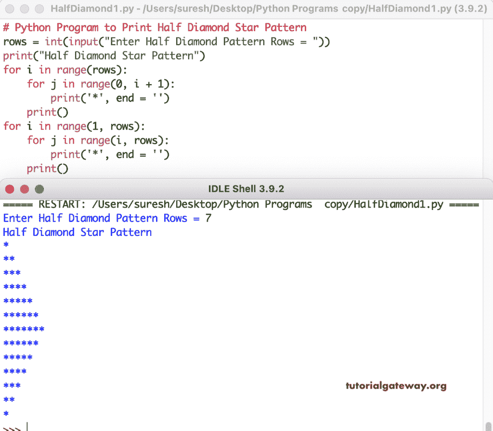

# Python 程序：打印星号的半菱形图案

> 原文：<https://www.tutorialgateway.org/python-program-to-print-half-diamond-star-pattern/>

写一个 Python 程序来打印星号的用于循环的半菱形图案。第一个 for 循环(对于范围(行)中的 I)从 0 迭代到行，对于范围(0，i + 1)中的 j，从 0 迭代到 I 值并打印星号。

```py
# Python Program to Print Half Diamond Star Pattern

rows = int(input("Enter Half Diamond Pattern Rows = "))

print("Half Diamond Star Pattern") 

for i in range(rows):
    for j in range(0, i + 1):
        print('*', end = '')
    print()

for i in range(1, rows):
    for j in range(i, rows):
        print('*', end = '')
    print()
```



这个 Python 程序使用 while 循环来打印星号的半菱形图案。

```py
# Python Program to Print Half Diamond Star Pattern

rows = int(input("Enter Half Diamond Pattern Rows = "))

print("Half Diamond Pattern") 
i = 0
while(i <= rows):
    j = 0
    while(j < i):
        print('*', end = '')
        j = j + 1
    i = i + 1
    print()

i = 1
while(i < rows):
    j = i;
    while(j < rows):
        print('*', end = '')
        j = j + 1
    i = i + 1
    print()
```

Python 半菱形星号图案，使用 while 循环输出

```py
Enter Half Diamond Pattern Rows = 9
Half Diamond Pattern

*
**
***
****
*****
******
*******
********
*********
********
*******
******
*****
****
***
**
*
```

在这个 Python 例子中，我们创建了一个半菱形模式函数来打印半菱形模式。它接受符号来代替半菱形中的星。

```py
# Python Program to Print Half Diamond Star Pattern

def halfDiamondPattern(rows, ch):
    for i in range(rows):
        for j in range(0, i + 1):
            print('%c' %ch, end = '')
        print()

    for i in range(1, rows):
        for j in range(i, rows):
            print('%c' %ch, end = '')
        print()

rows = int(input("Enter Half Diamond Pattern Rows = "))
ch = input("Symbol to use in Half Diamond Pattern = " )

print("Half Diamond Pattern") 
halfDiamondPattern(rows, ch)
```

```py
Enter Half Diamond Pattern Rows = 12
Symbol to use in Half Diamond Pattern = #
Half Diamond Pattern
#
##
###
####
#####
######
#######
########
#########
##########
###########
############
###########
##########
#########
########
#######
######
#####
####
###
##
#
```