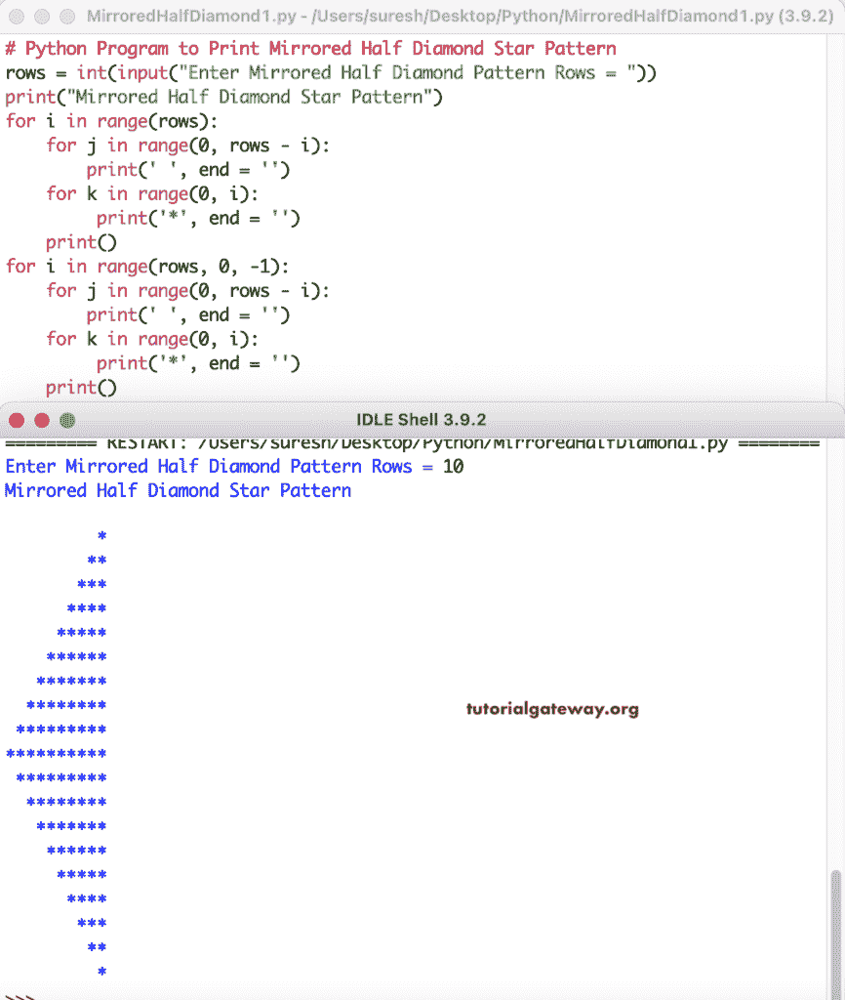

# Python 程序：打印星号的镜像半菱形图案

> 原文：<https://www.tutorialgateway.org/python-program-to-print-mirrored-half-diamond-star-pattern/>

编写一个 Python 程序来打印星号的用于循环的镜像半菱形图案。

```py
# Python Program to Print Mirrored Half Diamond Star Pattern

rows = int(input("Enter Mirrored Half Diamond Pattern Rows = "))

print("Mirrored Half Diamond Star Pattern") 

for i in range(rows):
    for j in range(0, rows - i):
        print(' ', end = '')
    for k in range(0, i):
         print('*', end = '')
    print()

for i in range(rows, 0, -1):
    for j in range(0, rows - i):
        print(' ', end = '')
    for k in range(0, i):
         print('*', end = '')
    print()
```



这个 Python 程序使用 while 循环打印星号的镜像半菱形图案。

```py
# Python Program to Print Mirrored Half Diamond Star Pattern

rows = int(input("Enter Mirrored Half Diamond Pattern Rows = "))

print("Mirrored Half Diamond Star Pattern") 

i = 1
while(i <= rows):
    j = 1
    while(j <= rows - i):
        print(' ', end = '')
        j = j + 1
    k = 1
    while(k <= i):
         print('*', end = '')
         k = k + 1
    i = i + 1
    print()

i = rows - 1
while(i > 0):
    j = 1
    while(j <= rows - i):
        print(' ', end = '')
        j = j + 1
    k = 1
    while(k <= i):
         print('*', end = '')
         k = k + 1
    i = i - 1
    print()
```

```py
Enter Mirrored Half Diamond Pattern Rows = 7
Mirrored Half Diamond Star Pattern
      *
     **
    ***
   ****
  *****
 ******
*******
 ******
  *****
   ****
    ***
     **
      *
>>> 
```

在这个 Python 示例中，我们创建了一个镜像半菱形函数来打印镜像半菱形图案。它用给定的符号替换镜像半菱形图案中的星星。

```py
# Python Program to Print Mirrored Half Diamond Star Pattern

def mirroredHalfDiamond(rows, ch):
    for i in range(rows):
        for j in range(0, rows - i):
            print(' ', end = '')
        for k in range(0, i):
             print('%c' %ch, end = '')
        print()

    for i in range(rows, 0, -1):
        for j in range(0, rows - i):
            print(' ', end = '')
        for k in range(0, i):
             print('%c' %ch, end = '')
        print()

rows = int(input("Enter Mirrored Half Diamond Pattern Rows = "))

ch = input("Symbol to use in Mirrored Half Diamond Pattern = ")

print("Mirrored Half Diamond Pattern") 

mirroredHalfDiamond(rows, ch)
```

```py
Enter Mirrored Half Diamond Pattern Rows = 8
Symbol to use in Mirrored Half Diamond Pattern = #
Mirrored Half Diamond Pattern

       #
      ##
     ###
    ####
   #####
  ######
 #######
########
 #######
  ######
   #####
    ####
     ###
      ##
       #
>>> 
```