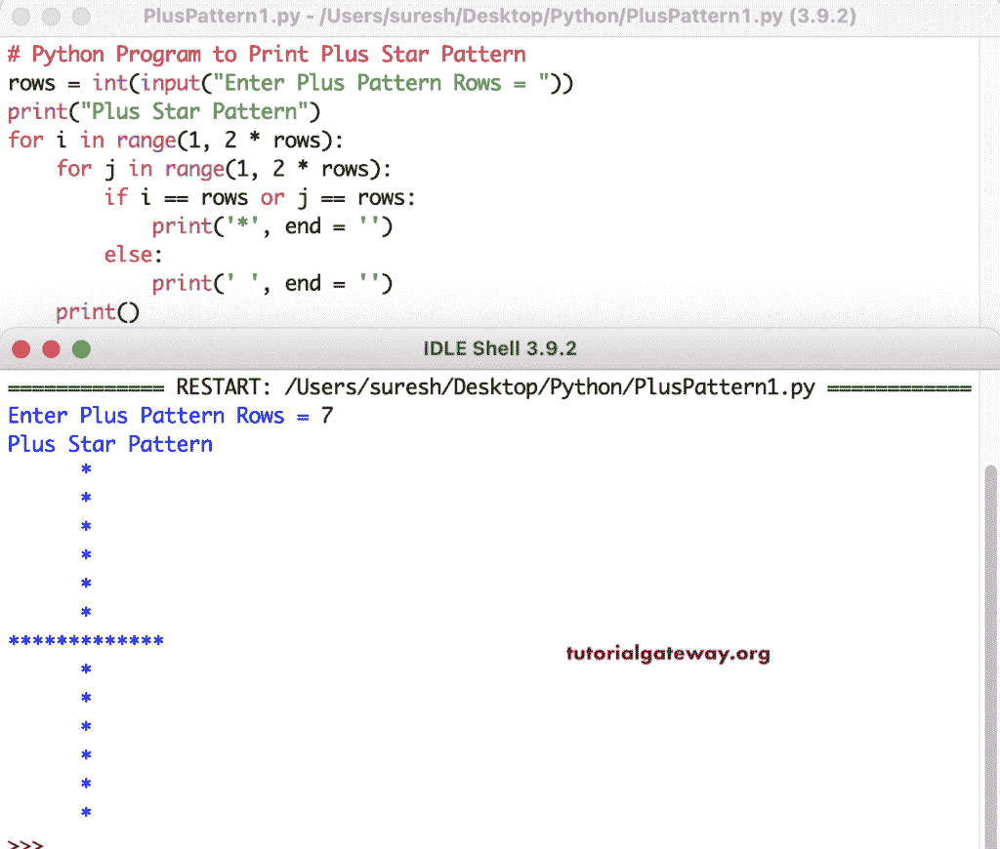

# Python 程序：打印加号星形图案

> 原文：<https://www.tutorialgateway.org/python-program-to-print-plus-star-pattern/>

使用 for 循环编写一个 Python 程序来打印加号星形模式。在这个 Python 示例中，for 循环将遍历 1 到 2 *行。if 语句检查 I 或 j 是否等于行，如果有效，则打印星号。

```py
# Python Program to Print Plus Star Pattern

rows = int(input("Enter Plus Pattern Rows = "))

print("Plus Star Pattern") 

for i in range(1, 2 * rows):
    for j in range(1, 2 * rows):
        if i == rows or j == rows:
            print('*', end = '')
        else:
            print(' ', end = '')
    print()
```



使用 while 循环打印加号星形图案的 Python 程序。

```py
# Python Program to Print Plus Star Pattern

rows = int(input("Enter Plus Pattern Rows = "))

print("Plus Star Pattern") 

i = 1
while(i < 2 * rows):
    j = 1
    while(j < 2 * rows):
        if i == rows or j == rows:
            print('*', end = '')
        else:
            print(' ', end = '')
        j = j + 1
    i = i + 1
    print()
```

```py
Enter Plus Pattern Rows = 7
Plus Star Pattern
      *      
      *      
      *      
      *      
      *      
      *      
*************
      *      
      *      
      *      
      *      
      *      
      *      
>>> 
```

在这个 Python 程序中，plusPattern 函数打印给定符号的 Plus 模式。

```py
# Python Program to Print Plus Star Pattern

def plusPattern(rows, ch):
    for i in range(1, 2 * rows):
        for j in range(1, 2 * rows):
            if i == rows or j == rows:
                print('%c' %ch, end = '')
            else:
                print(' ', end = '')
        print()

rows = int(input("Enter Plus Pattern Rows = "))
ch = input("Symbol to use in Plus Pattern = " )

print("Plus Pattern") 
plusPattern(rows, ch)
```

```py
Enter Plus Pattern Rows = 8
Symbol to use in Plus Pattern = $
Plus Pattern
       $       
       $       
       $       
       $       
       $       
       $       
       $       
$$$$$$$$$$$$$$$
       $       
       $       
       $       
       $       
       $       
       $       
       $       
>>> 
```