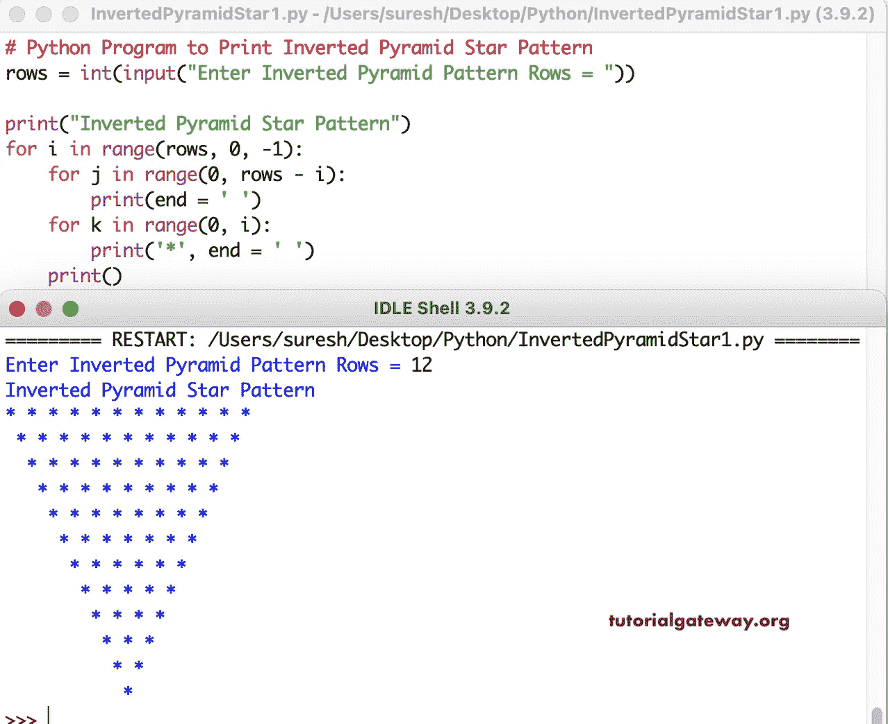

# Python 程序：打印星号的倒金字塔图案

> 原文：<https://www.tutorialgateway.org/python-program-to-print-inverted-pyramid-star-pattern/>

编写一个 Python 程序，使用 for 循环打印星号的倒金字塔图案。

```py
# Python Program to Print Inverted Pyramid Star Pattern

rows = int(input("Enter Inverted Pyramid Pattern Rows = "))

print("Inverted Pyramid Star Pattern") 

for i in range(rows, 0, -1):
    for j in range(0, rows - i):
        print(end = ' ')
    for k in range(0, i):
        print('*', end = ' ')
    print()
```



这个 Python 程序使用 while 循环打印星号的倒金字塔图案。

```py
rows = int(input("Enter Inverted Pyramid Pattern Rows = "))

print("Inverted Pyramid Star Pattern") 

i = rows
while(i >= 1):
    j = 0
    while(j <= rows - i):
        print(end = ' ')
        j = j + 1
    k = 0
    while(k < i):
        print('*', end = ' ')
        k = k + 1
    i = i - 1
    print()
```

```py
Enter Inverted Pyramid Pattern Rows = 14
Inverted Pyramid Star Pattern
 * * * * * * * * * * * * * * 
  * * * * * * * * * * * * * 
   * * * * * * * * * * * * 
    * * * * * * * * * * * 
     * * * * * * * * * * 
      * * * * * * * * * 
       * * * * * * * * 
        * * * * * * * 
         * * * * * * 
          * * * * * 
           * * * * 
            * * * 
             * * 
              * 
>>> 
```

在这个 Python 示例中，我们创建了一个倒金字塔函数来打印星号的倒金字塔图案。它用给定的符号代替空心倒金字塔星中的恒星。

```py
def invertedStarPyramid(rows, ch):
    for i in range(rows, 0, -1):
        for j in range(0, rows - i):
            print(end = ' ')
        for k in range(0, i):
            print('%c' %ch, end = ' ')
        print()

rows = int(input("Enter Inverted Pyramid Pattern Rows = "))

ch = input("Symbol to use in Inverted Pyramid Pattern = ")

print("Inverted Pyramid Star Pattern")
invertedStarPyramid(rows, ch)
```

```py
Enter Inverted Pyramid Pattern Rows = 15
Symbol to use in Inverted Pyramid Pattern = ^
Inverted Pyramid Star Pattern
^ ^ ^ ^ ^ ^ ^ ^ ^ ^ ^ ^ ^ ^ ^ 
 ^ ^ ^ ^ ^ ^ ^ ^ ^ ^ ^ ^ ^ ^ 
  ^ ^ ^ ^ ^ ^ ^ ^ ^ ^ ^ ^ ^ 
   ^ ^ ^ ^ ^ ^ ^ ^ ^ ^ ^ ^ 
    ^ ^ ^ ^ ^ ^ ^ ^ ^ ^ ^ 
     ^ ^ ^ ^ ^ ^ ^ ^ ^ ^ 
      ^ ^ ^ ^ ^ ^ ^ ^ ^ 
       ^ ^ ^ ^ ^ ^ ^ ^ 
        ^ ^ ^ ^ ^ ^ ^ 
         ^ ^ ^ ^ ^ ^ 
          ^ ^ ^ ^ ^ 
           ^ ^ ^ ^ 
            ^ ^ ^ 
             ^ ^ 
              ^ 
>>> 
```