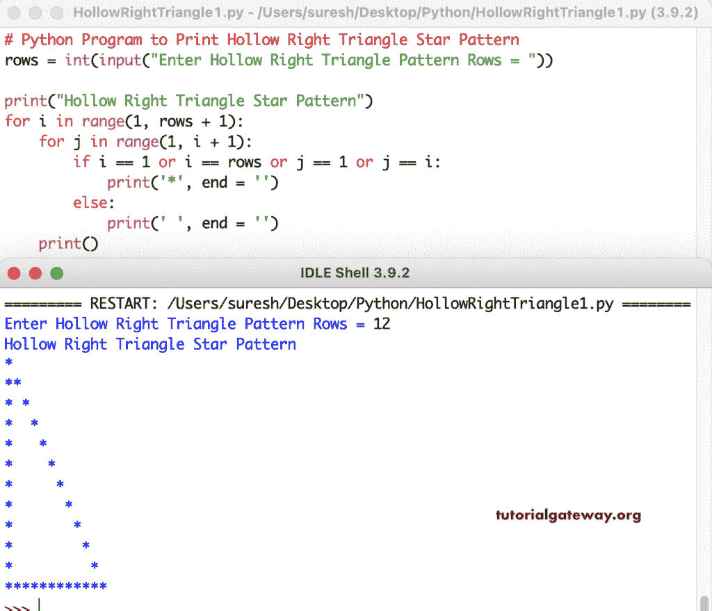

# Python 程序：打印空心直角三角形星形图案

> 原文：<https://www.tutorialgateway.org/python-program-to-print-hollow-right-triangle-star-pattern/>

写一个 Python 程序来打印用于循环的空心直角三角形星形图案。嵌套 for 循环从 1 到行迭代，I 和 if 条件检查大纲值并打印这些星号。

```py
# Python Program to Print Hollow Right Triangle Star Pattern

rows = int(input("Enter Hollow Right Triangle Pattern Rows = "))

print("Hollow Right Triangle Star Pattern") 

for i in range(1, rows + 1):
    for j in range(1, i + 1):
        if i == 1 or i == rows or j == 1 or j == i:
            print('*', end = '')
        else:
            print(' ', end = '')
    print()
```



这个 Python 程序使用 while 循环打印空心直角三角形星形图案。

```py
rows = int(input("Enter Hollow Right Triangle Pattern Rows = "))

print("Hollow Right Triangle Star Pattern") 

i = 1
while(i <= rows):
    j = 1
    while(j <= i):
        if i == 1 or i == rows or j == 1 or j == i:
            print('*', end = '')
        else:
            print(' ', end = '')
        j = j + 1
    i = i + 1
    print()
```

```py
Enter Hollow Right Triangle Pattern Rows = 12
Hollow Right Triangle Star Pattern
*
**
* *
*  *
*   *
*    *
*     *
*      *
*       *
*        *
*         *
************
>>> 
```

在这个 Python 示例中，我们创建了一个空心直角三角形函数来打印空心直角三角形图案。它用一个给定的符号代替空心的空心直角三角形星形。

```py
def hollowRightTriangle(rows, ch):
    for i in range(1, rows + 1):
        for j in range(1, i + 1):
            if i == 1 or i == rows or j == 1 or j == i:
                print('%c' %ch, end = '')
            else:
                print(' ', end = '')
        print()

rows = int(input("Enter Hollow Right Triangle Pattern Rows = "))

ch = input("Symbol to use in Hollow Right Triangle = ")

print("Hollow Right Triangle Star Pattern")

hollowRightTriangle(rows, ch)
```

```py
Enter Hollow Right Triangle Pattern Rows = 15
Symbol to use in Hollow Right Triangle = $
Hollow Right Triangle Star Pattern
$
$$
$ $
$  $
$   $
$    $
$     $
$      $
$       $
$        $
$         $
$          $
$           $
$            $
$$$$$$$$$$$$$$$
>>> 
```