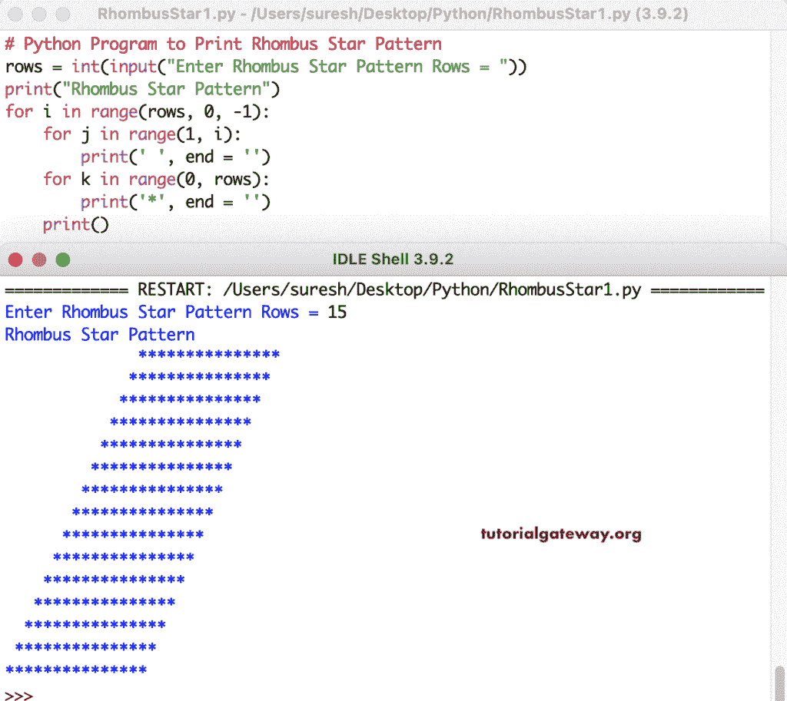

# Python 程序：打印菱形星形图案

> 原文：<https://www.tutorialgateway.org/python-program-to-print-rhombus-star-pattern/>

编写一个 Python 程序，使用 for 循环打印菱形图案。这个 Python 示例使用多个 for 循环来打印菱形星形图案。

```py
# Python Program to Print Rhombus Star Pattern

rows = int(input("Enter Rhombus Star Pattern Rows = "))

print("Rhombus Star Pattern") 

for i in range(rows, 0, -1):
    for j in range(1, i):
        print(' ', end = '')
    for k in range(0, rows):
        print('*', end = '')
    print()
```



使用 while 循环打印菱形星形图案的 Python 程序。

```py
# Python Program to Print Rhombus Star Pattern

rows = int(input("Enter Rhombus Star Pattern Rows = "))

print("Rhombus Star Pattern") 

i = rows
while(i >= 1):
    j = 1
    while(j <= i - 1):
        print(' ', end = '')
        j = j + 1

    k = 0
    while(k < rows):
        print('*', end = '')
        k = k + 1
    i = i - 1
    print()
```

```py
Enter Rhombus Star Pattern Rows = 20
Rhombus Star Pattern
                   ********************
                  ********************
                 ********************
                ********************
               ********************
              ********************
             ********************
            ********************
           ********************
          ********************
         ********************
        ********************
       ********************
      ********************
     ********************
    ********************
   ********************
  ********************
 ********************
********************
>>> 
```

在这个 Python 程序中，菱形符号函数接受一个符号，并打印给定符号的菱形图案。

```py
# Python Program to Print Rhombus Star Pattern

def rhombusStar(rows, ch):
    for i in range(rows, 0, -1):
        for j in range(1, i):
            print(' ', end = '')
        for k in range(0, rows):
            print('%c' %ch, end = '')
        print()

rows = int(input("Enter Rhombus Star Pattern Rows = "))

ch = input("Symbol to use in Half Diamond Pattern = " )

print("Rhombus Star Pattern")
rhombusStar(rows, ch)
```

```py
Enter Rhombus Star Pattern Rows = 14
Symbol to use in Half Diamond Pattern = #
Rhombus Star Pattern
             ##############
            ##############
           ##############
          ##############
         ##############
        ##############
       ##############
      ##############
     ##############
    ##############
   ##############
  ##############
 ##############
##############
>>> 
```