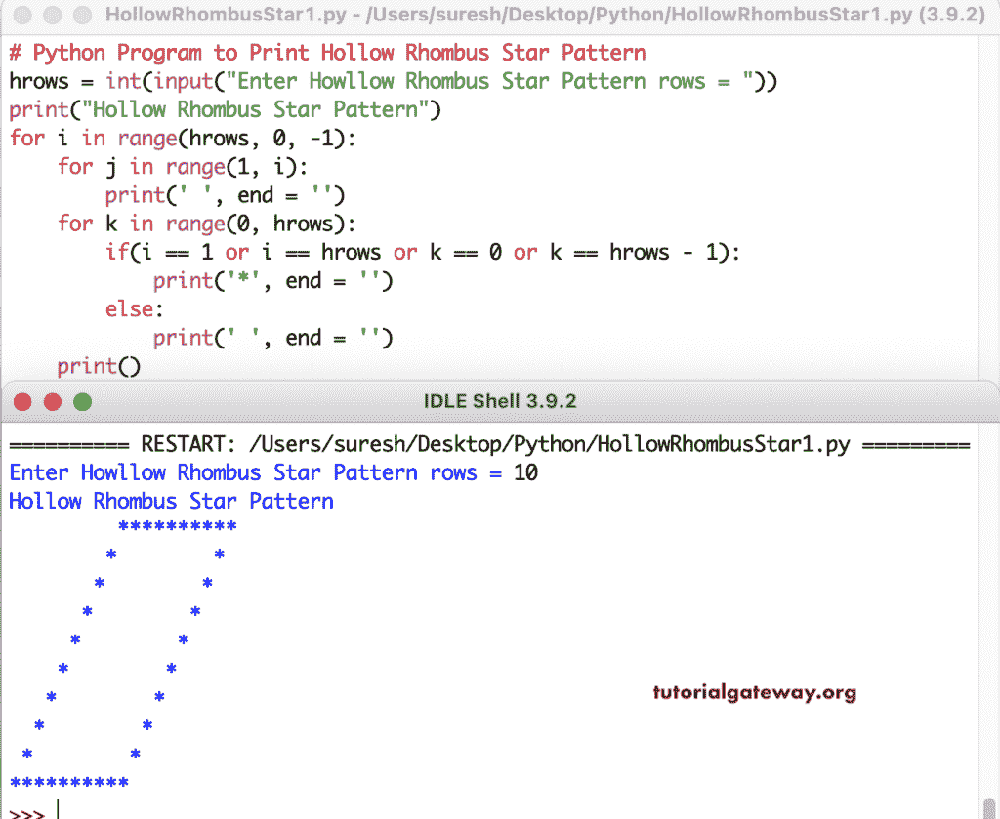

# Python 程序：打印星号的空心菱形图案

> 原文：<https://www.tutorialgateway.org/python-program-to-print-hollow-rhombus-star-pattern/>

写一个 Python 程序来打印星号的用于循环的空心菱形图案。嵌套的 for 循环和 if else 语句有助于打印空心菱形图案。

```py
# Python Program to Print Hollow Rhombus Star Pattern

hrows = int(input("Enter Howllow Rhombus Star Pattern rows = "))

print("Hollow Rhombus Star Pattern") 

for i in range(hrows, 0, -1):
    for j in range(1, i):
        print(' ', end = '')
    for k in range(0, hrows):
        if(i == 1 or i == hrows or k == 0 or k == hrows - 1):
            print('*', end = '')
        else:
            print(' ', end = '')
    print()
```



这个 Python 程序使用 while 循环打印星号的空心菱形图案。

```py
# Python Program to Print Hollow Rhombus Star Pattern

hrows = int(input("Enter Howllow Rhombus Star Pattern rows = "))

print("Hollow Rhombus Star Pattern") 
i = hrows
while(i >= 1):
    j = 1
    while(j <= i - 1):
        print(' ', end = '')
        j = j + 1

    k = 1
    while(k <= hrows):
        if(i == 1 or i == hrows or k == 1 or k == hrows):
            print('*', end = '')
        else:
            print(' ', end = '')
        k = k + 1
    i = i - 1
    print()
```

```py
Enter Howllow Rhombus Star Pattern rows = 15
Hollow Rhombus Star Pattern
              ***************
             *             *
            *             *
           *             *
          *             *
         *             *
        *             *
       *             *
      *             *
     *             *
    *             *
   *             *
  *             *
 *             *
***************
>>> 
```

在这个 Python 例子中，我们创建了一个中空菱形函数来打印中空菱形图案。它用一个给定的符号代替了空心的菱形图案星。

```py
# Python Program to Print Hollow Rhombus Star Pattern

def hollowRhombusStar(hrows, ch):
    for i in range(hrows, 0, -1):
        for j in range(1, i):
            print(' ', end = '')
        for k in range(0, hrows):
            if(i == 1 or i == hrows or k == 0 or k == hrows - 1):
                print('%c' %ch, end = '')
            else:
                print(' ', end = '')
        print()

hrows = int(input("Enter Howllow Rhombus Star Pattern hrows = "))
ch = input("Symbol to use in Howllow Rhombus Pattern = " )

print("Hollow Rhombus Star Pattern")
hollowRhombusStar(hrows, ch)
```

```py
Enter Howllow Rhombus Star Pattern hrows = 18
Symbol to use in Howllow Rhombus Pattern = #
Hollow Rhombus Star Pattern
                 ##################
                #                #
               #                #
              #                #
             #                #
            #                #
           #                #
          #                #
         #                #
        #                #
       #                #
      #                #
     #                #
    #                #
   #                #
  #                #
 #                #
##################
>>> 
```