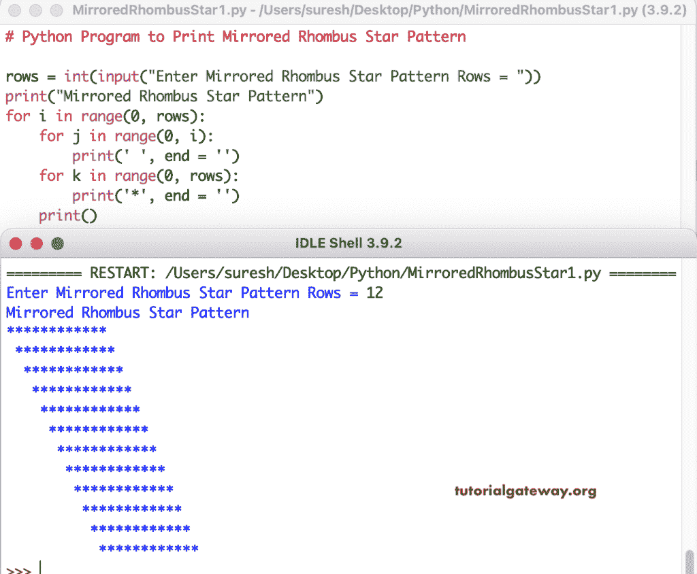

# Python 程序：打印星号的镜像菱形图案

> 原文：<https://www.tutorialgateway.org/python-program-to-print-mirrored-rhombus-star-pattern/>

编写一个 Python 程序，使用 for 循环打印星号的镜像菱形图案。

```py
# Python Program to Print Mirrored Rhombus Star Pattern

rows = int(input("Enter Mirrored Rhombus Star Pattern Rows = "))

print("Mirrored Rhombus Star Pattern") 

for i in range(0, rows):
    for j in range(0, i):
        print(' ', end = '')
    for k in range(0, rows):
        print('*', end = '')
    print()
```



这个 Python 程序使用 while 循环打印星号的镜像菱形图案。

```py
# Python Program to Print Mirrored Rhombus Star Pattern

rows = int(input("Enter Mirrored Rhombus Star Pattern Rows = "))

print("Mirrored Rhombus Star Pattern") 

i = 1

while(i <= rows):
    j = 1
    while( j < i):
        print(' ', end = '')
        j = j + 1
    k = 1
    while(k <= rows):
        print('*', end = '')
        k = k + 1
    i = i + 1
    print()
```

```py
Enter Mirrored Rhombus Star Pattern Rows = 20
Mirrored Rhombus Star Pattern
********************
 ********************
  ********************
   ********************
    ********************
     ********************
      ********************
       ********************
        ********************
         ********************
          ********************
           ********************
            ********************
             ********************
              ********************
               ********************
                ********************
                 ********************
                  ********************
                   ********************
>>> 
```

在这个 Python 示例中，我们创建了一个 mirroredRhombus 函数来打印镜像菱形图案。它用给定的符号替换镜像菱形图案中的星。

```py
# Python Program to Print Mirrored Rhombus Star Pattern

def mirroredRhombusStar(rows, ch):
    for i in range(0, rows):
        for j in range(0, i):
            print(' ', end = '')
        for k in range(0, rows):
            print('%c' %ch, end = '')
        print()

rows = int(input("Enter Mirrored Rhombus Star Pattern Rows = "))

ch = input("Symbol to use in Mirrored Rhombus Pattern = " )

print("Mirrored Rhombus Star Pattern")

mirroredRhombusStar(rows, ch)
```

```py
Enter Mirrored Rhombus Star Pattern Rows = 15
Symbol to use in Mirrored Rhombus Pattern = #
Mirrored Rhombus Star Pattern
###############
 ###############
  ###############
   ###############
    ###############
     ###############
      ###############
       ###############
        ###############
         ###############
          ###############
           ###############
            ###############
             ###############
              ###############
>>> 
```