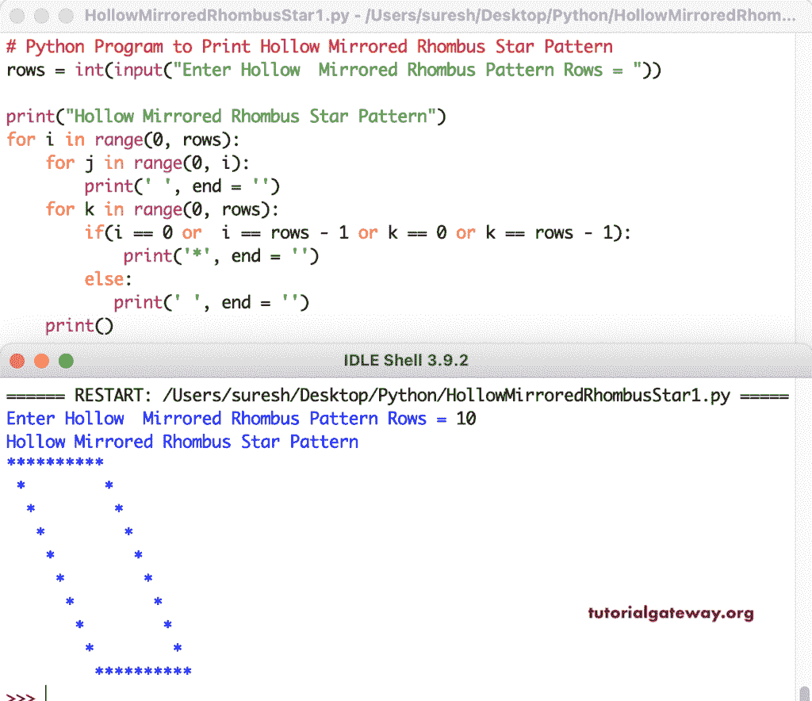

# Python 程序：打印中空镜像菱形星形图案

> 原文：<https://www.tutorialgateway.org/python-program-to-print-hollow-mirrored-rhombus-star-pattern/>

写一个 Python 程序来打印空心镜像菱形星形图案，用于循环。这个 Python 示例使用嵌套 for 循环和 if-else 返回中空的镜像菱形模式。

```py
# Python Program to Print Hollow Mirrored Rhombus Star Pattern

rows = int(input("Enter Hollow  Mirrored Rhombus Pattern Rows = "))

print("Hollow Mirrored Rhombus Star Pattern") 

for i in range(0, rows):
    for j in range(0, i):
        print(' ', end = '')
    for k in range(0, rows):
        if(i == 0 or  i == rows - 1 or k == 0 or k == rows - 1):
            print('*', end = '')
        else:
           print(' ', end = '') 
    print()
```



这个 Python 程序使用 while 循环来打印空心镜像菱形星形图案。

```py
# Python Program to Print Hollow Mirrored Rhombus Star Pattern

rows = int(input("Enter Hollow  Mirrored Rhombus Pattern Rows = "))

print("Hollow Mirrored Rhombus Star Pattern") 
i = 0
while(i < rows):
    j = 0
    while(j <= i):
        print(' ', end = '')
        j = j + 1
    k = 0
    while(k < rows):
        if(i == 0 or  i == rows - 1 or k == 0 or k == rows - 1):
            print('*', end = '')
        else:
           print(' ', end = '')
        k = k + 1
    i = i + 1
    print()
```

```py
Enter Hollow  Mirrored Rhombus Pattern Rows = 15
Hollow Mirrored Rhombus Star Pattern
 ***************
  *             *
   *             *
    *             *
     *             *
      *             *
       *             *
        *             *
         *             *
          *             *
           *             *
            *             *
             *             *
              *             *
               ***************
>>> 
```

在这个 Python 示例中，我们创建了一个中空镜像菱形函数来打印中空镜像菱形图案。它用给定的符号替换空心镜像菱形图案中的星形。

```py
# Python Program to Print Hollow Mirrored Rhombus Star Pattern

def hollowMirroredRhombus(rows, ch):
    for i in range(0, rows):
        for j in range(0, i):
            print(' ', end = '')
        for k in range(0, rows):
            if(i == 0 or  i == rows - 1 or k == 0 or k == rows - 1):
                print('%c' %ch, end = '')
            else:
               print(' ', end = '') 
        print()

rows = int(input("Enter Hollow Mirrored Rhombus Pattern Rows = "))

ch = input("Symbol to use in Hollow Mirrored Rhombus Pattern = " )

print("Hollow Mirrored Rhombus Star Pattern") 

hollowMirroredRhombus(rows, ch)
```

```py
Enter Hollow Mirrored Rhombus Pattern Rows = 18
Symbol to use in Hollow Mirrored Rhombus Pattern = $
Hollow Mirrored Rhombus Star Pattern
$$$$$$$$$$$$$$$$$$
 $                $
  $                $
   $                $
    $                $
     $                $
      $                $
       $                $
        $                $
         $                $
          $                $
           $                $
            $                $
             $                $
              $                $
               $                $
                $                $
                 $$$$$$$$$$$$$$$$$$
>>> 
```