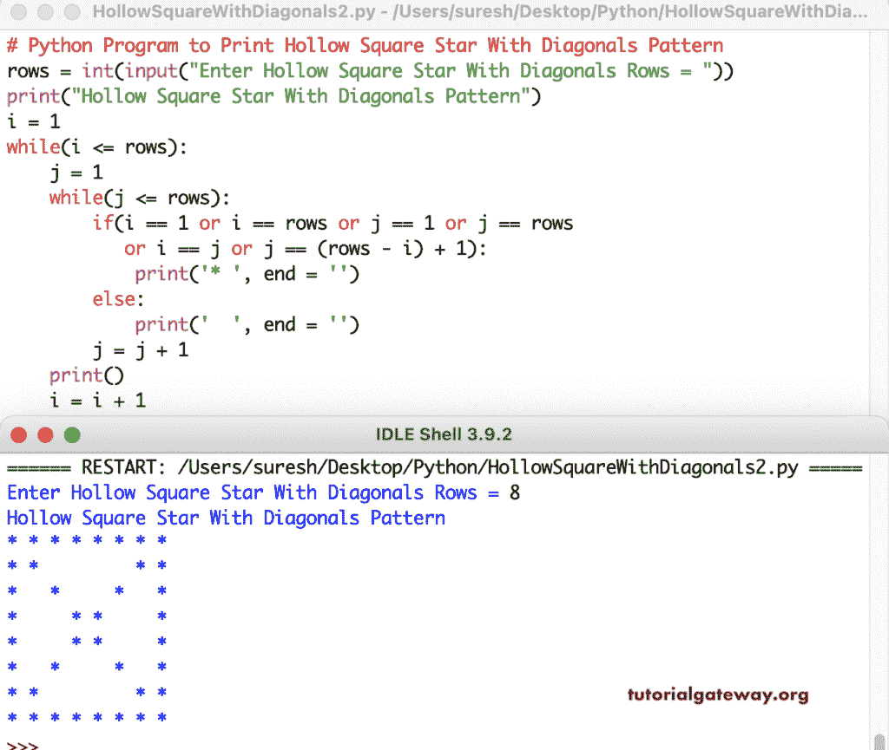

# Python 程序：打印带对角线的空心方形星

> 原文：<https://www.tutorialgateway.org/python-program-to-print-hollow-square-star-with-diagonals/>

编写一个 Python 程序，使用 for 循环打印带有对角线的空心方形星号。if 条件检查位置是对角线还是外部线条，如果为真，则打印星号；否则，打印一个空格。

```py
# Python Program to Print Hollow Square Star With Diagonals Pattern

rows = int(input("Enter Hollow Square Star With Diagonals Rows = "))

print("Hollow Square Star With Diagonals Pattern") 

for i in range(rows):
    for j in range(rows):
        if(i == 0 or i == rows - 1 or j == 0 or j == rows - 1
           or i == j or j == (rows - 1 - i)):
            print('* ', end = '')
        else:
            print('  ', end = '')
    print()
```

```py
Enter Hollow Square Star With Diagonals Rows = 12
Hollow Square Star With Diagonals Pattern
* * * * * * * * * * * * 
* *                 * * 
*   *             *   * 
*     *         *     * 
*       *     *       * 
*         * *         * 
*         * *         * 
*       *     *       * 
*     *         *     * 
*   *             *   * 
* *                 * * 
* * * * * * * * * * * * 
```

这个 Python 程序使用 while 循环打印带有对角线的空心方形星。

```py
# Python Program to Print Hollow Square Star With Diagonals Pattern

rows = int(input("Enter Hollow Square Star With Diagonals Rows = "))

print("Hollow Square Star With Diagonals Pattern") 
i = 1
while(i <= rows):
    j = 1
    while(j <= rows):
        if(i == 1 or i == rows or j == 1 or j == rows
           or i == j or j == (rows - i) + 1):
            print('* ', end = '')
        else:
            print('  ', end = '')
        j = j + 1
    print()
    i = i + 1
```



在这个 Python 示例中，我们创建了一个空心正方形对角线函数来打印带有对角线图案的空心正方形星号。它用给定的符号代替了空心空心正方形中带有对角线的星星。

```py
# Python Program to Print Hollow Square Star With Diagonals Pattern

def hollowSquareDiagonals(rows, ch):
    for i in range(rows):
        for j in range(rows):
            if(i == 0 or i == rows - 1 or j == 0 or j == rows - 1
               or i == j or j == (rows - 1 - i)):
                print('%c ' %ch, end = '')
            else:
                print('  ', end = '')
        print()

rows = int(input("Enter Hollow Square Star With Diagonals Rows = "))
ch = input("Symbol to use in Hollow Square With Diagonals = " )

print("Hollow Square With Diagonals Pattern")
hollowSquareDiagonals(rows, ch)
```

```py
Enter Hollow Square Star With Diagonals Rows = 15
Symbol to use in Hollow Square With Diagonals = $
Hollow Square With Diagonals Pattern
$ $ $ $ $ $ $ $ $ $ $ $ $ $ $ 
$ $                       $ $ 
$   $                   $   $ 
$     $               $     $ 
$       $           $       $ 
$         $       $         $ 
$           $   $           $ 
$             $             $ 
$           $   $           $ 
$         $       $         $ 
$       $           $       $ 
$     $               $     $ 
$   $                   $   $ 
$ $                       $ $ 
$ $ $ $ $ $ $ $ $ $ $ $ $ $ $ 
```