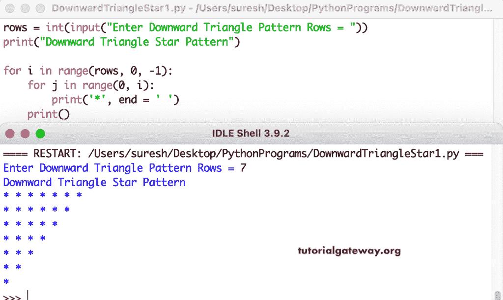

# Python 程序：打印星号的向下三角形图案

> 原文：<https://www.tutorialgateway.org/python-program-to-print-downward-triangle-star-pattern/>

写一个 Python 程序，用 for 循环打印星号的向下的三角形图案。

```py
rows = int(input("Enter Downward Triangle Pattern Rows = "))

print("Downward Triangle Star Pattern")

for i in range(rows, 0, -1):
    for j in range(0, i):
        print('*', end = ' ')
    print()
```



这个 Python 示例使用 while 循环显示了星号的向下三角形模式。

```py
rows = int(input("Enter Downward Triangle Pattern Rows = "))

print("Downward Triangle Star Pattern")

i = rows - 1

while(i >= 0):
    j = 0
    while(j <= i):
        print('*', end = ' ')
        j = j + 1
    print()
    i = i - 1
```

```py
Enter Downward Triangle Pattern Rows = 10
Downward Triangle Star Pattern
* * * * * * * * * * 
* * * * * * * * * 
* * * * * * * * 
* * * * * * * 
* * * * * * 
* * * * * 
* * * * 
* * * 
* * 
* 
```

在这个 [Python 程序](https://www.tutorialgateway.org/python-programming-examples/)中，我们使用了 pyDownwardTriangle 函数来显示给定字符的向下直角三角形。

```py
def pyDownwardTriangle(rows, ch):
    for i in range(rows, 0, -1):
        for j in range(0, i):
            print('%c' %ch, end = ' ')
        print()

rows = int(input("Enter Downward Triangle Star Pattern Rows = "))

ch = input("Symbol to use in Downward Triangle Pattern = " )

print("Downward Triangle Star Pattern")
pyDownwardTriangle(rows, ch)
```

```py
Enter Downward Triangle Star Pattern Rows = 14
Symbol to use in Downward Triangle Pattern = $
Downward Triangle Star Pattern
$ $ $ $ $ $ $ $ $ $ $ $ $ $ 
$ $ $ $ $ $ $ $ $ $ $ $ $ 
$ $ $ $ $ $ $ $ $ $ $ $ 
$ $ $ $ $ $ $ $ $ $ $ 
$ $ $ $ $ $ $ $ $ $ 
$ $ $ $ $ $ $ $ $ 
$ $ $ $ $ $ $ $ 
$ $ $ $ $ $ $ 
$ $ $ $ $ $ 
$ $ $ $ $ 
$ $ $ $ 
$ $ $ 
$ $ 
$ 
```