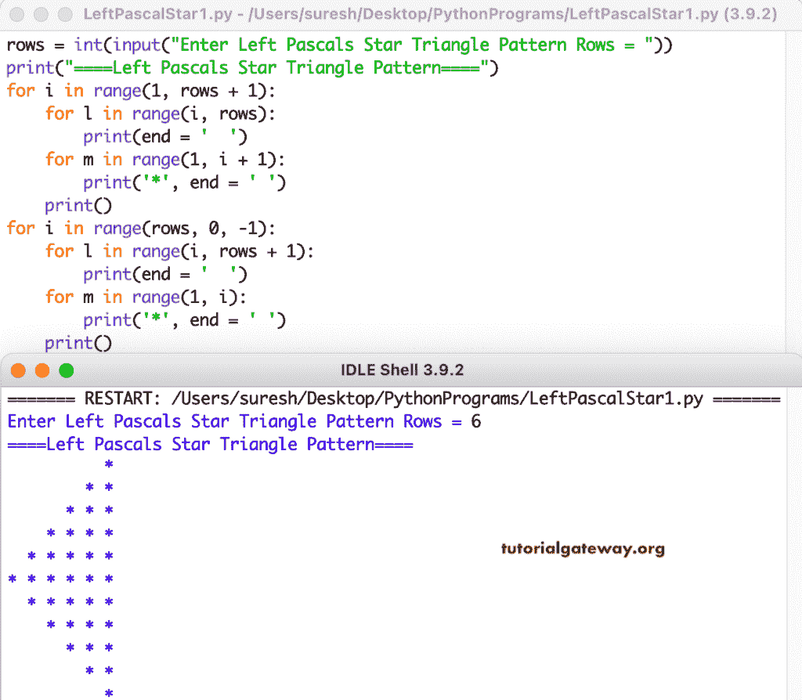

# Python 程序：打印左帕斯卡星形三角形

> 原文：<https://www.tutorialgateway.org/python-program-to-print-left-pascals-star-triangle/>

编写一个 Python 程序，使用 for 循环打印左帕斯卡星形三角形。

```py
rows = int(input("Enter Left Pascals Star Triangle Pattern Rows = "))

print("====Left Pascals Star Triangle Pattern====")

for i in range(1, rows + 1):
    for l in range(i, rows):
        print(end = '  ')
    for m in range(1, i + 1):
        print('*', end = ' ')
    print()

for i in range(rows, 0, -1):
    for l in range(i, rows + 1):
        print(end = '  ')
    for m in range(1, i):
        print('*', end = ' ')
    print()
```



这个 Python 程序使用 while 循环打印左帕斯卡星形三角形。

```py
rows = int(input("Enter Left Pascals Star Triangle Pattern Rows = "))

print("====Left Pascals Star Triangle Pattern====")
i = 1
while(i <= rows):

    j = i
    while(j < rows):
        print(end = '  ')
        j = j + 1

    l = 1
    while(l <= i):
        print('*', end = ' ')
        l = l + 1
    print()
    i = i + 1

i = rows
while(i >= 1):
    j = i
    while(j <= rows):
        print(end = '  ')
        j = j + 1

    l = 1
    while(l < i):
        print('*', end = ' ')
        l = l + 1
    print()
    i = i - 1
```

```py
Enter Left Pascals Star Triangle Pattern Rows = 7
====Left Pascals Star Triangle Pattern====
            * 
          * * 
        * * * 
      * * * * 
    * * * * * 
  * * * * * * 
* * * * * * * 
  * * * * * * 
    * * * * * 
      * * * * 
        * * * 
          * * 
            * 
```

在这个 [Python 示例](https://www.tutorialgateway.org/python-programming-examples/)中，我们使用了 pyLeftPascalStar 函数来显示给定字符的左帕斯卡三角形模式。

```py
def pyLeftPascalsStar(rows, ch):
    for i in range(1, rows + 1):
        for l in range(i, rows):
            print(end = '  ')
        for m in range(1, i + 1):
            print('%c' %ch, end = ' ')  
        print()

    for i in range(rows, 0, -1):
        for l in range(i, rows + 1):
            print(end = '  ')
        for m in range(1, i):
            print('%c' %ch, end = ' ')  
        print()

rows = int(input("Enter Left Pascals Star Triangle Pattern Rows = "))
ch = input("Symbol to use in Sandglass Pattern = " )

print("====Left Pascals Star Triangle Pattern====")
pyLeftPascalsStar(rows, ch)
```

```py
Enter Left Pascals Star Triangle Pattern Rows = 10
Symbol to use in Sandglass Pattern = $
====Left Pascals Star Triangle Pattern====
                  $ 
                $ $ 
              $ $ $ 
            $ $ $ $ 
          $ $ $ $ $ 
        $ $ $ $ $ $ 
      $ $ $ $ $ $ $ 
    $ $ $ $ $ $ $ $ 
  $ $ $ $ $ $ $ $ $ 
$ $ $ $ $ $ $ $ $ $ 
  $ $ $ $ $ $ $ $ $ 
    $ $ $ $ $ $ $ $ 
      $ $ $ $ $ $ $ 
        $ $ $ $ $ $ 
          $ $ $ $ $ 
            $ $ $ $ 
              $ $ $ 
                $ $ 
                  $ 
```