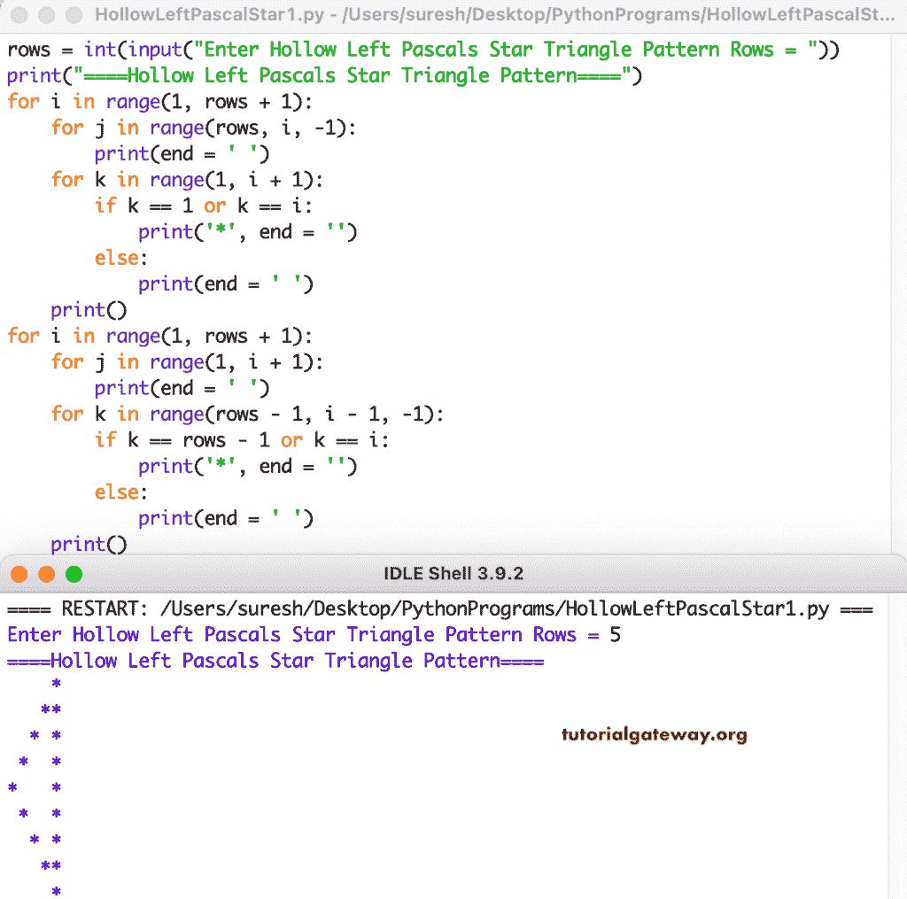

# Python 程序：打印空心左帕斯卡星形三角形

> 原文：<https://www.tutorialgateway.org/python-program-to-print-hollow-left-pascals-star-triangle/>

写一个 Python 程序来打印空心左帕斯卡星形三角形图案，用于循环。

```py
rows = int(input("Enter Hollow Left Pascals Star Triangle Pattern Rows = "))

print("====Hollow Left Pascals Star Triangle Pattern====")

for i in range(1, rows + 1):
    for j in range(rows, i, -1):
        print(end = ' ')
    for k in range(1, i + 1):
        if k == 1 or k == i:
            print('*', end = '')
        else:
            print(end = ' ')      
    print()

for i in range(1, rows + 1):
    for j in range(1, i + 1):
        print(end = ' ')
    for k in range(rows - 1, i - 1, -1):
        if k == rows - 1 or k == i:
            print('*', end = '')
        else:
            print(end = ' ')
    print()
```



这个 Python 程序使用 while 循环打印空心的左帕斯卡星形三角形图案。

```py
rows = int(input("Enter Hollow Left Pascals Star Triangle Pattern Rows = "))

print("====Hollow Left Pascals Star Triangle Pattern====")
i = 1
while(i <= rows):
    j = rows
    while ( j > i):
        print(end = ' ')
        j = j - 1
    k = 1
    while( k <= i):
        if k == 1 or k == i:
            print('*', end = '')
        else:
            print(end = ' ')
        k = k + 1
    print()
    i = i + 1

i = 1
while(i <= rows - 1):
    j = 1
    while(j <= i):
        print(end = ' ')
        j = j + 1
    k = rows - 1
    while(k >= i):
        if k == rows - 1 or k == i:
            print('*', end = '')
        else:
            print(end = ' ')
        k = k - 1
    print()
    i = i + 1
```

```py
Enter Hollow Left Pascals Star Triangle Pattern Rows = 7
====Hollow Left Pascals Star Triangle Pattern====
      *
     **
    * *
   *  *
  *   *
 *    *
*     *
 *    *
  *   *
   *  *
    * *
     **
      *
```

在这个 [Python 示例](https://www.tutorialgateway.org/python-programming-examples/)中，我们使用了 pyHollowLeftPascalsStar 函数来显示给定字符的空心左帕斯卡三角形。

```py
def pyHollowLeftPascalStar(rows, ch):
    for i in range(1, rows + 1):
        for j in range(rows, i, -1):
            print(end = ' ')
        for k in range(1, i + 1):
            if k == 1 or k == i:
                print('%c' %ch, end = '')
            else:
                print(end = ' ')      
        print()

    for i in range(1, rows + 1):
        for j in range(1, i + 1):
            print(end = ' ')
        for k in range(rows - 1, i - 1, -1):
            if k == rows - 1 or k == i:
                print('%c' %ch, end = '')
            else:
                print(end = ' ')
        print()

rows = int(input("Enter Hollow Left Pascals Star Triangle Pattern Rows = "))

ch = input("Symbol to use in Hollow Left Pascals Triangle Pattern = " )

print("====Hollow Left Pascals Triangle Pattern====")
pyHollowLeftPascalStar(rows, ch)
```

```py
Enter Hollow Left Pascals Star Triangle Pattern Rows = 14
Symbol to use in Hollow Left Pascals Triangle Pattern = #
====Hollow Left Pascals Triangle Pattern====
             #
            ##
           # #
          #  #
         #   #
        #    #
       #     #
      #      #
     #       #
    #        #
   #         #
  #          #
 #           #
#            #
 #           #
  #          #
   #         #
    #        #
     #       #
      #      #
       #     #
        #    #
         #   #
          #  #
           # #
            ##
             #
```