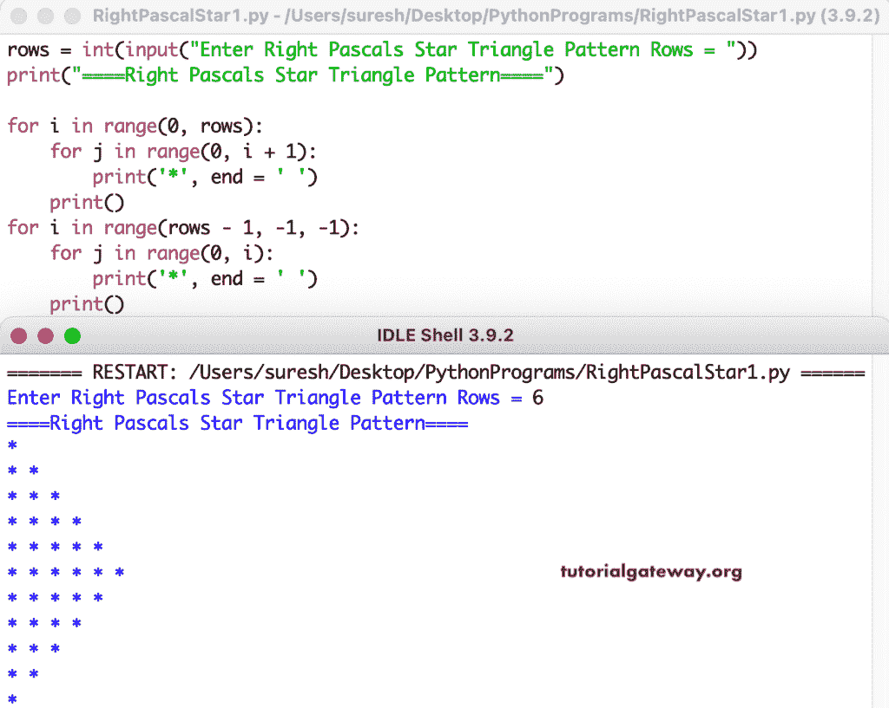

# Python 程序：打印星号的右帕斯卡三角形

> 原文：<https://www.tutorialgateway.org/python-program-to-print-right-pascals-star-triangle/>

编写一个 Python 程序，使用 for 循环打印右帕斯卡星号三角形。

```py
rows = int(input("Enter Right Pascals Star Triangle Pattern Rows = "))

print("====Right Pascals Star Triangle Pattern====")

for i in range(0, rows):
    for j in range(0, i + 1):
        print('*', end = ' ')
    print()

for i in range(rows - 1, -1, -1):
    for j in range(0, i):
        print('*', end = ' ')
    print()
```



这个 Python 程序使用 while 循环打印右帕斯卡星号三角形。

```py
rows = int(input("Enter Right Pascals Star Triangle Pattern Rows = "))

print("====Right Pascals Star Triangle Pattern====")
i = 0
while(i < rows):
    j = 0
    while(j <= i):
        print('*', end = ' ')
        j = j + 1
    print()
    i = i + 1

i = rows - 1
while(i >= 0):
    j = 0
    while(j <= i - 1):
        print('*', end = ' ')
        j = j + 1
    print()
    i = i - 1
```

```py
Enter Right Pascals Star Triangle Pattern Rows = 7
====Right Pascals Star Triangle Pattern====
* 
* * 
* * * 
* * * * 
* * * * * 
* * * * * * 
* * * * * * * 
* * * * * * 
* * * * * 
* * * * 
* * * 
* * 
* 
```

在这个 [Python 示例](https://www.tutorialgateway.org/python-programming-examples/)中，我们使用了 pyRightPascalStar 函数来显示给定字符的右帕斯卡三角形模式。

```py
def pyRightPascalsStarTriangle(rows, ch):
    for i in range(0, rows):
        for j in range(0, i + 1):
            print('%c' %ch, end = ' ')
        print()

    for i in range(rows - 1, -1, -1):
        for j in range(0, i):
            print('%c' %ch, end = ' ')
        print()

rows = int(input("Enter Right Pascals Star Triangle Pattern Rows = "))

ch = input("Symbol to use in Right Pascals Star Triangle Pattern = " )

print("====Right Pascals Star Triangle Pattern====")
pyRightPascalsStarTriangle(rows, ch)
```

```py
Enter Right Pascals Star Triangle Pattern Rows = 10
Symbol to use in Right Pascals Star Triangle Pattern = $
====Right Pascals Star Triangle Pattern====
$ 
$ $ 
$ $ $ 
$ $ $ $ 
$ $ $ $ $ 
$ $ $ $ $ $ 
$ $ $ $ $ $ $ 
$ $ $ $ $ $ $ $ 
$ $ $ $ $ $ $ $ $ 
$ $ $ $ $ $ $ $ $ $ 
$ $ $ $ $ $ $ $ $ 
$ $ $ $ $ $ $ $ 
$ $ $ $ $ $ $ 
$ $ $ $ $ $ 
$ $ $ $ $ 
$ $ $ $ 
$ $ $ 
$ $ 
$
```