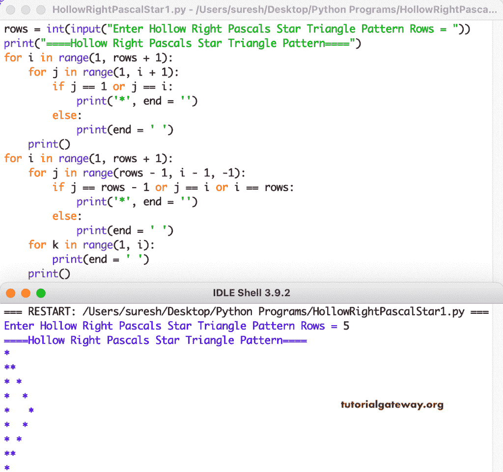

# Python 程序：打印空心直角三角形

> 原文：<https://www.tutorialgateway.org/python-program-to-print-hollow-right-pascals-star-triangle/>

写一个 Python 程序打印空心直角帕斯卡星号三角形图案，用于循环。

```py
rows = int(input("Enter Hollow Right Pascals Star Triangle Pattern Rows = "))

print("====Hollow Right Pascals Star Triangle Pattern====")

for i in range(1, rows + 1):
    for j in range(1, i + 1):
        if j == 1 or j == i:
            print('*', end = '')
        else:
            print(end = ' ')      
    print()

for i in range(1, rows + 1):
    for j in range(rows - 1, i - 1, -1):
        if j == rows - 1 or j == i or i == rows:
            print('*', end = '')
        else:
            print(end = ' ')
    for k in range(1, i):
        print(end = ' ')
    print()
```



这个 Python 程序使用 while 循环打印空心的右帕斯卡星号三角形图案。

```py
rows = int(input("Enter Hollow Right Pascals Star Triangle Pattern Rows = "))

print("====Hollow Right Pascals Star Triangle Pattern====")
i = 1

while(i <= rows):
    j = 1
    while(j <= i):
        if j == 1 or j == i:
            print('*', end = '')
        else:
            print(end = ' ')
        j = j + 1
    print()
    i = i + 1

i = 1
while(i <= rows - 1):
    j = rows - 1
    while(j >= i):
        if j == rows - 1 or j == i or i == rows:
            print('*', end = '')
        else:
            print(end = ' ')
        j = j - 1
    k = 1
    while(k < i):
        print(end = ' ')
        k = k + 1
    print()
    i = i + 1
```

```py
Enter Hollow Right Pascals Star Triangle Pattern Rows = 8
====Hollow Right Pascals Star Triangle Pattern====
*
**
* *
*  *
*   *
*    *
*     *
*      *
*     *
*    * 
*   *  
*  *   
* *    
**     
*
```

在这个 [Python 示例](https://www.tutorialgateway.org/python-programming-examples/)中，我们使用了 pyHollowRightPascalsStar 函数来显示给定字符的空心直角帕斯卡三角形模式。

```py
def pyHollowRightPascalStar(rows, ch):
    for i in range(1, rows + 1):
        for j in range(1, i + 1):
            if j == 1 or j == i:
                print('%c' %ch, end = '')
            else:
                print(end = ' ')      
        print()

    for i in range(1, rows + 1):
        for j in range(rows - 1, i - 1, -1):
            if j == rows - 1 or j == i or i == rows:
                print('%c' %ch, end = '')
            else:
                print(end = ' ')
        for k in range(1, i):
            print(end = ' ')
        print()

rows = int(input("Enter Hollow Right Pascals Star Triangle Pattern Rows = "))

ch = input("Symbol to use in Hollow Right Pascals Triangle Pattern = " )

print("====Hollow Right Pascals Star Triangle Pattern====")

pyHollowRightPascalStar(rows, ch)
```

```py
Enter Hollow Right Pascals Star Triangle Pattern Rows = 10
Symbol to use in Hollow Right Pascals Triangle Pattern = #
====Hollow Right Pascals Star Triangle Pattern====
#
##
# #
#  #
#   #
#    #
#     #
#      #
#       #
#        #
#       #
#      # 
#     #  
#    #   
#   #    
#  #     
#      
##       
#
```