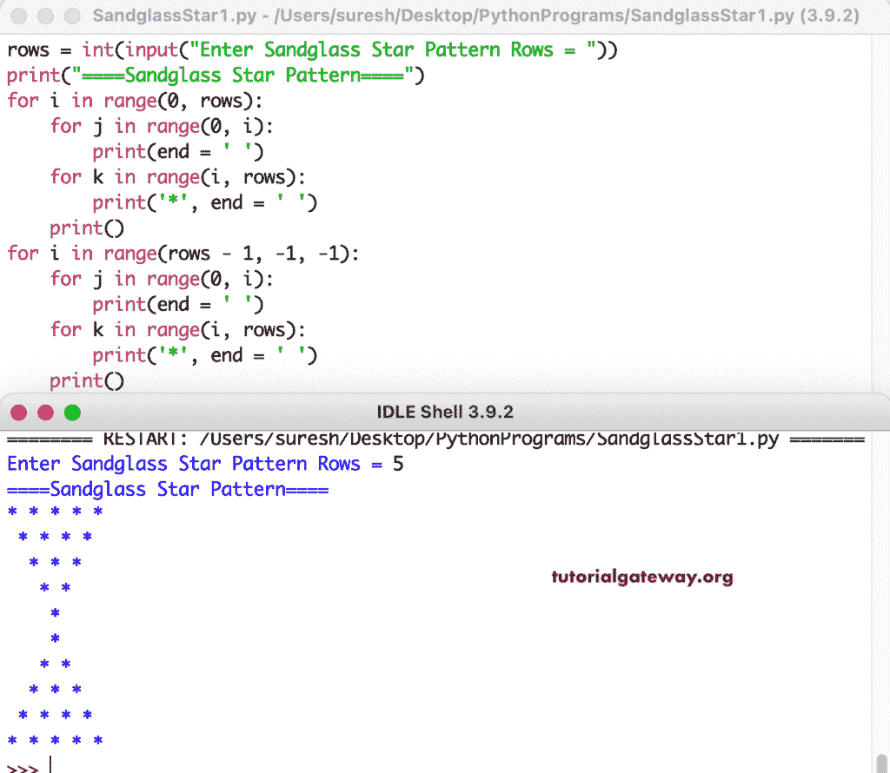

# Python 程序：打印星号的沙漏图案

> 原文：<https://www.tutorialgateway.org/python-program-to-print-sandglass-star-pattern/>

编写一个 Python 程序，使用 for 循环打印星号的沙漏图案。

```py
rows = int(input("Enter Sandglass Star Pattern Rows = "))

print("====Sandglass Star Pattern====")

for i in range(0, rows):
    for j in range(0, i):
        print(end = ' ')
    for k in range(i, rows):
        print('*', end = ' ')                
    print()

for i in range(rows - 1, -1, -1):
    for j in range(0, i):
        print(end = ' ')
    for k in range(i, rows):
        print('*', end = ' ')      
    print()
```



这个 Python 程序使用 while 循环打印星号的沙漏图案。

```py
rows = int(input("Enter Sandglass Star Pattern Rows = "))

print("====Sandglass Star Pattern====")
i = 0
while(i <= rows - 1):
    j = 0
    while(j < i):
        print(end = ' ')
        j = j + 1
    k = i
    while(k <= rows - 1):
        print('*', end = ' ')
        k = k + 1
    print()
    i = i + 1

i = rows - 1
while(i >= 0):
    j = 0
    while(j < i):
        print(end = ' ')
        j = j + 1
    k = i
    while(k <= rows - 1):
        print('*', end = ' ')
        k = k + 1
    print()   
    i = i - 1
```

```py
Enter Sandglass Star Pattern Rows = 7
====Sandglass Star Pattern====
* * * * * * * 
 * * * * * * 
  * * * * * 
   * * * * 
    * * * 
     * * 
      * 
      * 
     * * 
    * * * 
   * * * * 
  * * * * * 
 * * * * * * 
* * * * * * * 
```

在这个 [Python 示例](https://www.tutorialgateway.org/python-programming-examples/)中，我们使用了 pySandglassStar 函数来显示给定角色的沙漏图案。

```py
def pySandglassStar(rows, ch):
    for i in range(0, rows):
        for j in range(0, i):
            print(end = ' ')
        for k in range(i, rows):
            print('%c' %ch, end = ' ')               
        print()

    for i in range(rows - 1, -1, -1):
        for j in range(0, i):
            print(end = ' ')
        for k in range(i, rows):
            print('%c' %ch, end = ' ')     
        print()

rows = int(input("Enter Sandglass Star Pattern Rows = "))

ch = input("Symbol to use in Sandglass Pattern = " )

print("====Sandglass Pattern====")
pySandglassStar(rows, ch)
```

```py
Enter Sandglass Star Pattern Rows = 12
Symbol to use in Sandglass Pattern = $
====Sandglass Pattern====
$ $ $ $ $ $ $ $ $ $ $ $ 
 $ $ $ $ $ $ $ $ $ $ $ 
  $ $ $ $ $ $ $ $ $ $ 
   $ $ $ $ $ $ $ $ $ 
    $ $ $ $ $ $ $ $ 
     $ $ $ $ $ $ $ 
      $ $ $ $ $ $ 
       $ $ $ $ $ 
        $ $ $ $ 
         $ $ $ 
          $ $ 
           $ 
           $ 
          $ $ 
         $ $ $ 
        $ $ $ $ 
       $ $ $ $ $ 
      $ $ $ $ $ $ 
     $ $ $ $ $ $ $ 
    $ $ $ $ $ $ $ $ 
   $ $ $ $ $ $ $ $ $ 
  $ $ $ $ $ $ $ $ $ $ 
 $ $ $ $ $ $ $ $ $ $ $ 
$ $ $ $ $ $ $ $ $ $ $ $ 
```