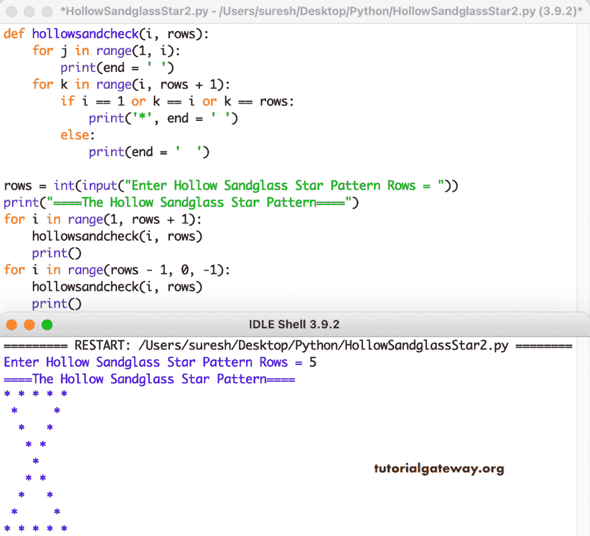

# Python 程序：打印空心沙漏星形图案

> 原文：<https://www.tutorialgateway.org/python-program-to-print-hollow-sandglass-star-pattern/>

写一个 Python 程序打印空心沙漏星形图案用于循环。

```py
rows = int(input("Enter Hollow Sandglass Star Pattern Rows = "))

print("====The Hollow Sandglass Star Pattern====")

for i in range(1, rows + 1):
    for j in range(1, i):
        print(end = ' ')
    for k in range(i, rows + 1):
        if i == 1 or k == i or k == rows:
            print('*', end = ' ')
        else:
            print(end = '  ')
    print()

for i in range(rows - 1, 0, -1):
    for j in range(1, i):
        print(end = ' ')
    for k in range(i, rows + 1):
        if i == 1 or k == i or k == rows:
            print('*', end = ' ')
        else:
            print(end = '  ')      
    print()
```

```py
Enter Hollow Sandglass Star Pattern Rows = 8
====The Hollow Sandglass Star Pattern====
* * * * * * * * 
 *           * 
  *         * 
   *       * 
    *     * 
     *   * 
      * * 
       * 
      * * 
     *   * 
    *     * 
   *       * 
  *         * 
 *           * 
* * * * * * * * 
```

在这个 Python 示例中，我们创建了一个函数，该函数将运行重复 for 循环来打印空心沙漏星形图案。

```py
def hollowsandcheck(i, rows):
    for j in range(1, i):
        print(end = ' ')
    for k in range(i, rows + 1):
        if i == 1 or k == i or k == rows:
            print('*', end = ' ')
        else:
            print(end = '  ')

rows = int(input("Enter Hollow Sandglass Star Pattern Rows = "))

print("====The Hollow Sandglass Star Pattern====")

for i in range(1, rows + 1):
    hollowsandcheck(i, rows)
    print()

for i in range(rows - 1, 0, -1):
    hollowsandcheck(i, rows)    
    print()
```



这个 Python 程序使用 while 循环显示星星的空心沙漏图案。

```py
def hollowsandcheck(i, rows):
    j = 1
    while(j < i):
        print(end = ' ')
        j = j + 1
    k = i
    while(k <= rows):
        if i == 1 or k == i or k == rows:
            print('*', end = ' ')
        else:
            print(end = '  ')
        k = k + 1

rows = int(input("Enter Hollow Sandglass Star Pattern Rows = "))

print("====The Hollow Sandglass Star Pattern====")
i = 1

while(i <= rows):
    hollowsandcheck(i, rows)
    print()
    i = i + 1

i = rows - 1
while(i >= 1):
    hollowsandcheck(i, rows)    
    print()
    i = i - 1
```

```py
Enter Hollow Sandglass Star Pattern Rows = 10
====The Hollow Sandglass Star Pattern====
* * * * * * * * * * 
 *               * 
  *             * 
   *           * 
    *         * 
     *       * 
      *     * 
       *   * 
        * * 
         * 
        * * 
       *   * 
      *     * 
     *       * 
    *         * 
   *           * 
  *             * 
 *               * 
* * * * * * * * * * 
```

这个 [Python 示例](https://www.tutorialgateway.org/python-programming-examples/)允许用户输入字符并打印给定字符的空心沙漏图案。

```py
def hollowsandcheck(i, rows, ch):
    for j in range(1, i):
        print(end = ' ')
    for k in range(i, rows + 1):
        if i == 1 or k == i or k == rows:
            print('%c' %ch, end = ' ')
        else:
            print(end = '  ')

rows = int(input("Enter Hollow Sandglass Star Pattern Rows = "))
ch = input("Symbol to use in Hollow Sandglass Pattern = " )

print("====The Hollow Sandglass Star Pattern====")

for i in range(1, rows + 1):
    hollowsandcheck(i, rows, ch)
    print()

for i in range(rows - 1, 0, -1):
    hollowsandcheck(i, rows, ch)    
    print()
```

```py
Enter Hollow Sandglass Star Pattern Rows = 13
Symbol to use in Hollow Sandglass Pattern = @
====The Hollow Sandglass Star Pattern====
@ @ @ @ @ @ @ @ @ @ @ @ @ 
 @                     @ 
  @                   @ 
   @                 @ 
    @               @ 
     @             @ 
      @           @ 
       @         @ 
        @       @ 
         @     @ 
          @   @ 
           @ @ 
            @ 
           @ @ 
          @   @ 
         @     @ 
        @       @ 
       @         @ 
      @           @ 
     @             @ 
    @               @ 
   @                 @ 
  @                   @ 
 @                     @ 
@ @ @ @ @ @ @ @ @ @ @ @ @ 
```