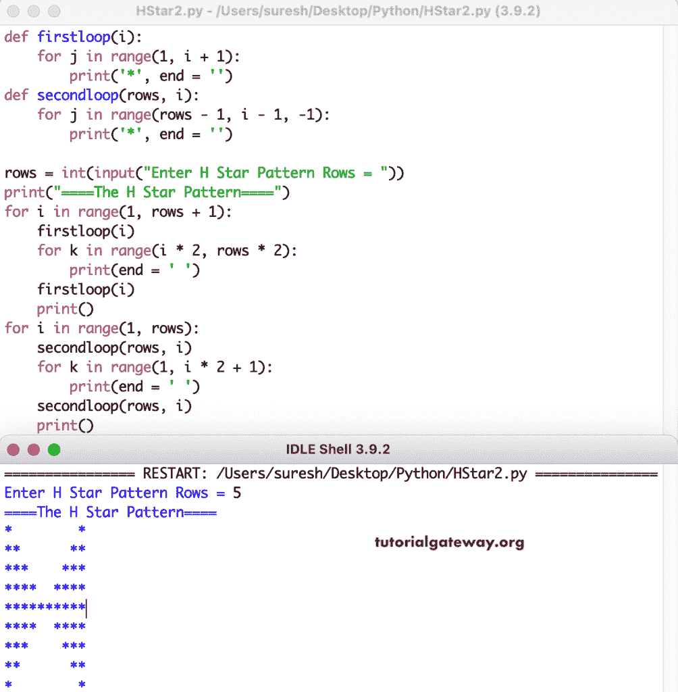

# Python 程序：打印星号的`H`图案

> 原文：<https://www.tutorialgateway.org/python-program-to-print-h-star-pattern/>

写一个 Python 程序，用 for 循环打印星号的 H 图案。

```py
rows = int(input("Enter H Star Pattern Rows = "))

print("====The H Star Pattern====")

for i in range(1, rows + 1):
    for j in range(1, i + 1):
        print('*', end = '')
    for k in range(i * 2, rows * 2):
        print(end = ' ')
    for l in range(1, i + 1):
        print('*', end = '')
    print()

for i in range(1, rows):
    for j in range(rows - 1, i - 1, -1):
        print('*', end = '')
    for k in range(1, i * 2 + 1):
        print(end = ' ')
    for l in range(rows - 1, i - 1, -1):
        print('*', end = '')
    print()
```

```py
Enter H Star Pattern Rows = 8
====The H Star Pattern====
*              *
**            **
***          ***
****        ****
*****      *****
******    ******
*******  *******
****************
*******  *******
******    ******
*****      *****
****        ****
***          ***
**            **
*              *
```

在这个 Python 例子中，我们创建了多个函数，运行重复的 for 循环来打印星号的字母 H 图案。

```py
def firstloop(i):
    for j in range(1, i + 1):
        print('*', end = '')

def secondloop(rows, i):
    for j in range(rows - 1, i - 1, -1):
        print('*', end = '')

rows = int(input("Enter H Star Pattern Rows = "))

print("====The H Star Pattern====")
for i in range(1, rows + 1):
    firstloop(i)
    for k in range(i * 2, rows * 2):
        print(end = ' ')
    firstloop(i)
    print()

for i in range(1, rows):
    secondloop(rows, i)
    for k in range(1, i * 2 + 1):
        print(end = ' ')
    secondloop(rows, i)
    print()
```



这个 [Python 程序](https://www.tutorialgateway.org/python-programming-examples/)允许用户输入字符并打印给定字符的字母 H 模式。

```py
def firstloop(i, ch):
    for j in range(1, i + 1):
        print('%c' %ch, end = '')

def secondloop(rows, i, ch):
    for j in range(rows - 1, i - 1, -1):
        print('%c' %ch, end = '')

rows = int(input("Enter H Star Pattern Rows = "))
ch = input("Symbol to use in H Pattern = " )
print("====The H Star Pattern====")

for i in range(1, rows + 1):
    firstloop(i, ch)
    for k in range(i * 2, rows * 2):
        print(end = ' ')
    firstloop(i, ch)
    print()

for i in range(1, rows):
    secondloop(rows, i, ch)
    for k in range(1, i * 2 + 1):
        print(end = ' ')
    secondloop(rows, i, ch)
    print()
```

```py
Enter H Star Pattern Rows = 13
Symbol to use in H Pattern = $
====The H Star Pattern====
$                        $
$$                      $$
$$$                    $$$
$$$$                  $$$$
$$$$$                $$$$$
$$$$$$              $$$$$$
$$$$$$$            $$$$$$$
$$$$$$$$          $$$$$$$$
$$$$$$$$$        $$$$$$$$$
$$$$$$$$$$      $$$$$$$$$$
$$$$$$$$$$$    $$$$$$$$$$$
$$$$$$$$$$$$  $$$$$$$$$$$$
$$$$$$$$$$$$$$$$$$$$$$$$$$
$$$$$$$$$$$$  $$$$$$$$$$$$
$$$$$$$$$$$    $$$$$$$$$$$
$$$$$$$$$$      $$$$$$$$$$
$$$$$$$$$        $$$$$$$$$
$$$$$$$$          $$$$$$$$
$$$$$$$            $$$$$$$
$$$$$$              $$$$$$
$$$$$                $$$$$
$$$$                  $$$$
$$$                    $$$
$$                      $$
$                        $
```