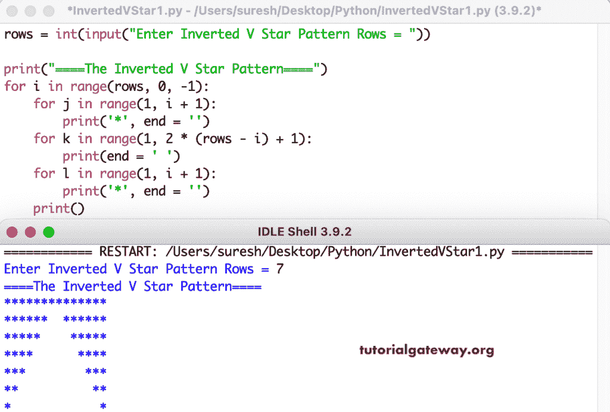

# Python 程序：打印倒`V`星形图案

> 原文：<https://www.tutorialgateway.org/python-program-to-print-inverted-v-star-pattern/>

写一个 Python 程序，用 for 循环在正方形星形图案内打印倒`V`星形图案或半菱形。

```py
rows = int(input("Enter Inverted V Star Pattern Rows = "))

print("====The Inverted V Star Pattern====")

for i in range(rows, 0, -1):
    for j in range(1, i + 1):
        print('*', end = '')
    for k in range(1, 2 * (rows - i) + 1):
        print(end = ' ')
    for l in range(1, i + 1):
        print('*', end = '')
    print()
```



这个 Python 程序使用 while 循环显示星星的倒`V`星形图案。

```py
rows = int(input("Enter Inverted V Star Pattern Rows = "))

print("====The Inverted V Star Pattern====")
i = rows

while(i >= 1):
    j = 1
    while(j <= i):
        print('*', end = '')
        j = j + 1
    k = 1
    while(k <= 2 * (rows - i)):
        print(end = ' ')
        k = k + 1
    l = 1
    while(l <= i):
        print('*', end = '')
        l = l + 1
    print()
    i = i - 1
```

```py
Enter Inverted V Star Pattern Rows = 9
====The Inverted V Star Pattern====
******************
********  ********
*******    *******
******      ******
*****        *****
****          ****
***            ***
**              **
*                *
```

在这个 Python 模式[示例](https://www.tutorialgateway.org/python-programming-examples/)中，我们创建了一个允许输入任何字符并打印给定字符的倒 V 的函数。

```py
def InvertedVStar(i, ch):
    for j in range(1, i + 1):
        print('%c' %ch, end = '')

rows = int(input("Enter Inverted V Star Pattern Rows = "))

ch = input("Symbol to use in V Pattern = " )

print("====The Inverted V Star Pattern====")

for i in range(rows, 0, -1):
    InvertedVStar(i, ch)
    for k in range(1, 2 * (rows - i) + 1):
        print(end = ' ')
    InvertedVStar(i, ch)
    print()
```

```py
Enter Inverted V Star Pattern Rows = 14
Symbol to use in V Pattern = #
====The Inverted V Star Pattern====
############################
#############  #############
############    ############
###########      ###########
##########        ##########
#########          #########
########            ########
#######              #######
######                ######
#####                  #####
####                    ####
###                      ###
##                        ##
#                          #
```