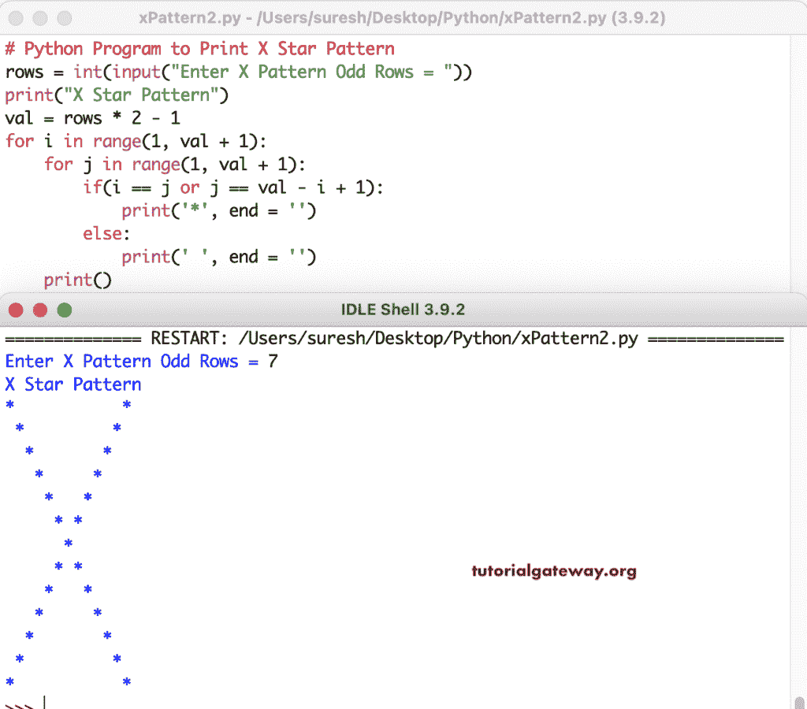

# Python 程序：打印星号的`X`图案

> 原文：<https://www.tutorialgateway.org/python-program-to-print-x-star-pattern/>

编写一个 Python 程序，使用 for 循环打印 X 模式。

```py
# Python Program to Print X Star Pattern

rows = int(input("Enter X Pattern Odd Rows = "))

print("X Star Pattern") 

for i in range(0, rows):
    for j in range(0, rows):
        if(i == j or j == rows - 1 - i):
            print('*', end = '')
        else:
            print(' ', end = '')
    print()
```

```py
Enter X Pattern Odd Rows = 15
X Star Pattern
*             *
 *           * 
  *         *  
   *       *   
    *     *    
     *   *     
      * *      
       *       
      * *      
     *   *     
    *     *    
   *       *   
  *         *  
 *           * 
*             *
```

在这个 Python X 星型模式程序中，我们扭曲了 for 循环。

```py
# Python Program to Print X Star Pattern

rows = int(input("Enter X Pattern Odd Rows = "))

print("X Star Pattern") 

val = rows * 2 - 1

for i in range(1, val + 1):
    for j in range(1, val + 1):
        if(i == j or j == val - i + 1):
            print('*', end = '')
        else:
            print(' ', end = '')
    print()
```



Python 程序使用 while 循环打印 X 模式。

```py
# Python Program to Print X Star Pattern

rows = int(input("Enter X Pattern Odd Rows = "))

print("X Star Pattern") 

val = rows * 2 - 1
i = 1

while(i <=  val):
    j = 1
    while(j <= val):
        if(i == j or j == val - i + 1):
            print('*', end = '')
        else:
            print(' ', end = '')
        j = j + 1
    i = i + 1
    print()
```

```py
Enter X Pattern Odd Rows = 6
X Star Pattern
*         *
 *       * 
  *     *  
   *   *   
    * *    
     *     
    * *    
   *   *   
  *     *  
 *       * 
*         *
```

在这个 Python 程序中，printXPattern 函数接受一个符号，并打印给定符号的 X 模式。

```py
# Python Program to Print X Star Pattern

def printXPattern(rows, ch):
    val = rows * 2 - 1
    for i in range(1, val + 1):
        for j in range(1, val + 1):
            if(i == j or j == val - i + 1):
                print('%c' %ch, end = '')
            else:
                print(' ', end = '')
        print()

rows = int(input("Enter X Pattern Odd Rows = "))

ch = input("Symbol to use in Half Diamond Pattern = " )

print("X Star Pattern")

printXPattern(rows, ch)
```

```py
Enter X Pattern Odd Rows = 8
Symbol to use in Half Diamond Pattern = $
X Star Pattern
$             $
 $           $ 
  $         $  
   $       $   
    $     $    
     $   $     
      $ $      
       $       
      $ $      
     $   $     
    $     $    
   $       $   
  $         $  
 $           $ 
$             $
```