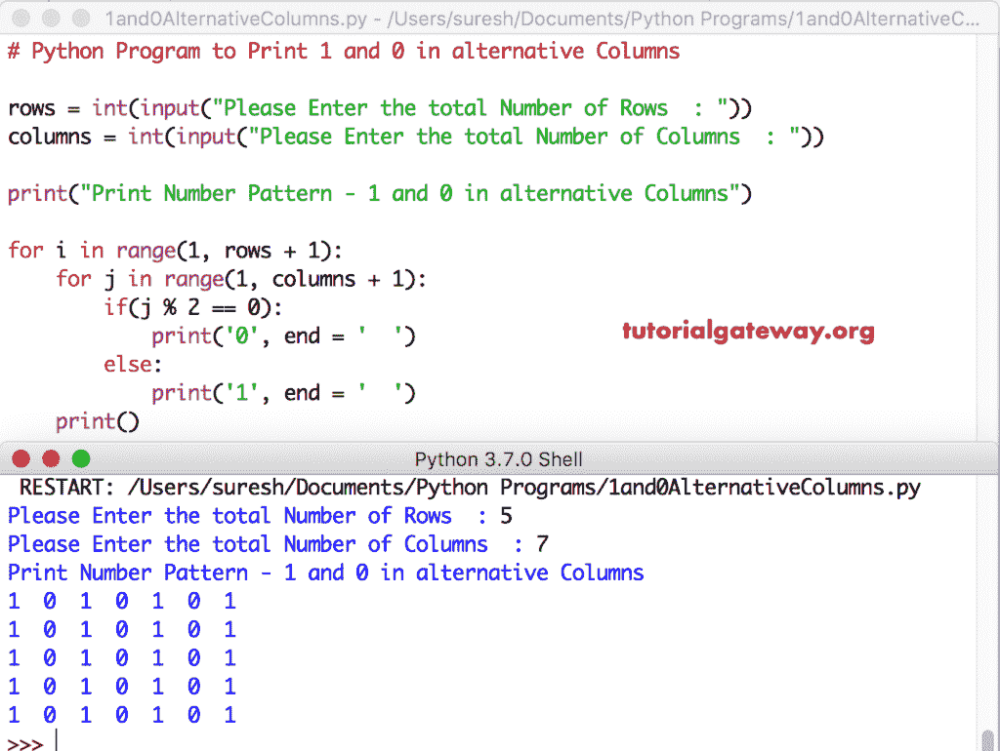

# Python 程序：在交替列中打印`1`和`0`

> 原文：<https://www.tutorialgateway.org/python-program-to-print-1-and-0-in-alternative-columns/>

编写一个 Python 程序，使用 While 循环和 For 循环在交替列中打印 1 和 0。

## Python 程序使用 For 循环在交替列中打印 1 和 0

这个 Python 程序允许用户输入行和列的总数。接下来，我们使用 Python 嵌套 For 循环来打印 1 和 0，直到它到达用户指定的行和列。

```py
# Python Program to Print 1 and 0 in alternative Columns

rows = int(input("Please Enter the total Number of Rows  : "))
columns = int(input("Please Enter the total Number of Columns  : "))

print("Print Number Pattern - 1 and 0 in alternative Columns") 

for i in range(1, rows + 1):
    for j in range(1, columns + 1):
        if(j % 2 == 0):          
            print('0', end = '  ')
        else:
            print('1', end = '  ')
    print()
```



## 使用 While 循环在交替列中显示 1 和 0 的 Python 程序

在这个 [Python](https://www.tutorialgateway.org/python-tutorial/) 程序中，我们将 [For Loop](https://www.tutorialgateway.org/python-for-loop/) 替换为 [While Loop](https://www.tutorialgateway.org/python-while-loop/)

```py
# Python Program to Print 1 and 0 in alternative Columns

rows = int(input("Please Enter the total Number of Rows  : "))
columns = int(input("Please Enter the total Number of Columns  : "))

print("Print Number Pattern - 1 and 0 in alternative Columns")
i = 1
while(i <= rows):
    j = 1
    while(j <= columns):
        if(j % 2 != 0):          
            print('1', end = '  ')
        else:
            print('0', end = '  ')
        j = j + 1
    i = i + 1
    print()
```

替代列中 1 和 0 的 Python 输出

```py
Please Enter the total Number of Rows  : 7
Please Enter the total Number of Columns  : 12
Print Number Pattern - 1 and 0 in alternative Columns
1  0  1  0  1  0  1  0  1  0  1  0  
1  0  1  0  1  0  1  0  1  0  1  0  
1  0  1  0  1  0  1  0  1  0  1  0  
1  0  1  0  1  0  1  0  1  0  1  0  
1  0  1  0  1  0  1  0  1  0  1  0  
1  0  1  0  1  0  1  0  1  0  1  0  
1  0  1  0  1  0  1  0  1  0  1  0 
```

## Python 程序在没有 If 的替代列中显示 1 和 0

在这个 [Python 程序](https://www.tutorialgateway.org/python-programming-examples/)中，我们在 print 语句中找到偶数或奇数列。这样，您就可以避免在嵌套 For 循环中使用额外的 [If 语句](https://www.tutorialgateway.org/python-if-statement/)。

```py
# Python Program to Print 1 and 0 in alternative Columns

rows = int(input("Please Enter the total Number of Rows  : "))
columns = int(input("Please Enter the total Number of Columns  : "))

print("Print Number Pattern - 1 and 0 in alternative Columns") 

for i in range(1, rows + 1):
    for j in range(1, columns + 1):
        print('%d' %(j % 2), end = '  ')
    print()
```

替代列中 1 和 0 的 Python 输出

```py
Please Enter the total Number of Rows  : 5
Please Enter the total Number of Columns  : 8
Print Number Pattern - 1 and 0 in alternative Columns
1  0  1  0  1  0  1  0  
1  0  1  0  1  0  1  0  
1  0  1  0  1  0  1  0  
1  0  1  0  1  0  1  0  
1  0  1  0  1  0  1  0 
```

## Python 程序在交替列中显示 0 和 1

如果要打印 0，并在替代列中打印 1，请将 print 语句中的 1 替换为 0，将 0 替换为 1

```py
# Python Program to Print 1 and 0 in alternative Columns

rows = int(input("Please Enter the total Number of Rows  : "))
columns = int(input("Please Enter the total Number of Columns  : "))

print("Print Number Pattern - 1 and 0 in alternative Columns") 

for i in range(1, rows + 1):
    for j in range(1, columns + 1):
        if(j % 2 != 0):          
            print('0', end = '  ')
        else:
            print('1', end = '  ')
    print()
```

Python 输出 0 和 1 在交替列

```py
Please Enter the total Number of Rows  : 6
Please Enter the total Number of Columns  : 9
Print Number Pattern - 1 and 0 in alternative Columns
0  1  0  1  0  1  0  1  0  
0  1  0  1  0  1  0  1  0  
0  1  0  1  0  1  0  1  0  
0  1  0  1  0  1  0  1  0  
0  1  0  1  0  1  0  1  0  
0  1  0  1  0  1  0  1  0 
```