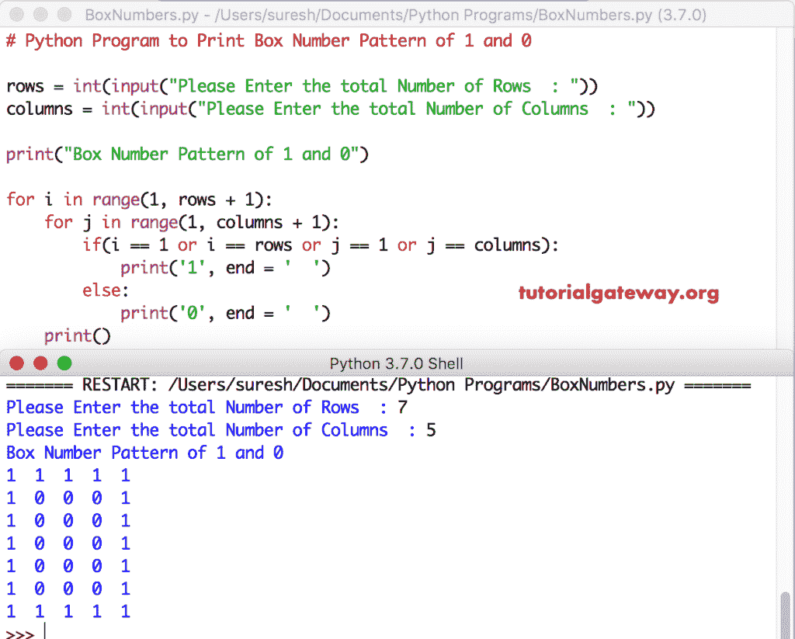

# Python 程序：打印箱号图案

> 原文：<https://www.tutorialgateway.org/python-program-to-print-box-number-pattern/>

编写一个 Python 程序，使用 For 循环和 While 循环打印 1 和 0 的箱号模式，并给出一个例子。

## 使用 For 循环打印 1 和 0 的箱号模式的 Python 程序

这个 Python 程序允许用户输入行和列的总数。接下来，我们使用 Python 嵌套 For 循环来迭代每行和每列项目。在循环中，我们使用 [If 语句](https://www.tutorialgateway.org/python-if-statement/)来检查行数字和列数字是 1 还是最大值。如果为真，则 [Python](https://www.tutorialgateway.org/python-tutorial/) 打印 1，否则打印 0。

```py
# Python Program to Print Box Number Pattern of 1 and 0

rows = int(input("Please Enter the total Number of Rows  : "))
columns = int(input("Please Enter the total Number of Columns  : "))

print("Box Number Pattern of 1 and 0") 

for i in range(1, rows + 1):
    for j in range(1, columns + 1):
        if(i == 1 or i == rows or j == 1 or j == columns):          
            print('1', end = '  ')
        else:
            print('0', end = '  ')
    print()
```



## 使用 While 循环显示 1 和 0 的箱号模式的 Python 程序

这个 [Python 程序](https://www.tutorialgateway.org/python-programming-examples/)同上。然而，我们将[换成了](https://www.tutorialgateway.org/python-for-loop/)[同时换成了](https://www.tutorialgateway.org/python-while-loop/)

```py
# Python Program to Print Box Number Pattern of 1 and 0

rows = int(input("Please Enter the total Number of Rows  : "))
columns = int(input("Please Enter the total Number of Columns  : "))

print("Box Number Pattern of 1 and 0") 
i = 1 
while(i <= rows):
    j = 1;
    while(j <= columns ):
        if(i == 1 or i == rows or j == 1 or j == columns):          
            print('1', end = '  ')
        else:
            print('0', end = '  ')
        j = j + 1
    i = i + 1
    print()
```

```py
Please Enter the total Number of Rows  : 8
Please Enter the total Number of Columns  : 14
Box Number Pattern of 1 and 0
1  1  1  1  1  1  1  1  1  1  1  1  1  1  
1  0  0  0  0  0  0  0  0  0  0  0  0  1  
1  0  0  0  0  0  0  0  0  0  0  0  0  1  
1  0  0  0  0  0  0  0  0  0  0  0  0  1  
1  0  0  0  0  0  0  0  0  0  0  0  0  1  
1  0  0  0  0  0  0  0  0  0  0  0  0  1  
1  0  0  0  0  0  0  0  0  0  0  0  0  1  
1  1  1  1  1  1  1  1  1  1  1  1  1  1  
>>> 
```

## 0 和 1 的箱号模式的 Python 程序

如果希望 Python 显示数字 0 和 1 的框模式，请将 print 语句中的 1 替换为 0，将 0 替换为 1。

```py
# Python Program to Print Box Number Pattern of 1 and 0

rows = int(input("Please Enter the total Number of Rows  : "))
columns = int(input("Please Enter the total Number of Columns  : "))

print("Box Number Pattern of 1 and 0") 

for i in range(1, rows + 1):
    for j in range(1, columns + 1):
        if(i == 1 or i == rows or j == 1 or j == columns):          
            print('0', end = '  ')
        else:
            print('1', end = '  ')
    print()
```

```py
Please Enter the total Number of Rows  : 9
Please Enter the total Number of Columns  : 15
Box Number Pattern of 1 and 0
0  0  0  0  0  0  0  0  0  0  0  0  0  0  0  
0  1  1  1  1  1  1  1  1  1  1  1  1  1  0  
0  1  1  1  1  1  1  1  1  1  1  1  1  1  0  
0  1  1  1  1  1  1  1  1  1  1  1  1  1  0  
0  1  1  1  1  1  1  1  1  1  1  1  1  1  0  
0  1  1  1  1  1  1  1  1  1  1  1  1  1  0  
0  1  1  1  1  1  1  1  1  1  1  1  1  1  0  
0  1  1  1  1  1  1  1  1  1  1  1  1  1  0  
0  0  0  0  0  0  0  0  0  0  0  0  0  0  0  
>>> 
```