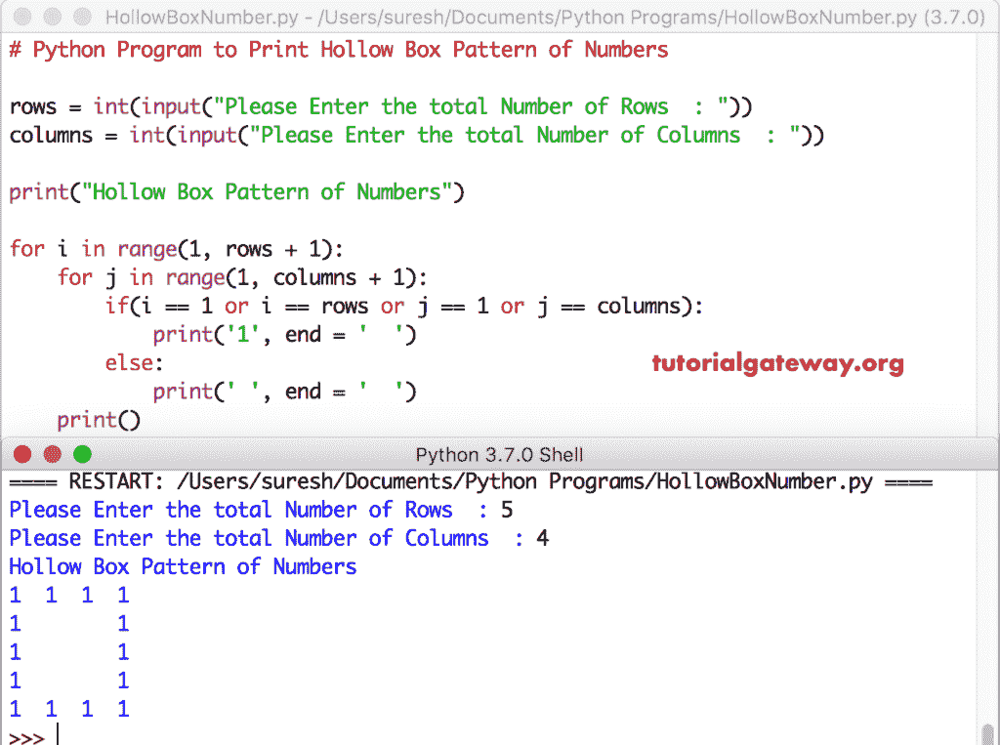

# Python 程序：打印数字空心盒图案

> 原文：<https://www.tutorialgateway.org/python-program-to-print-hollow-box-pattern-of-numbers/>

写一个 Python 程序，用 For 循环和 While 循环打印数字 1 和 0 的空心盒模式，并举例说明。

## 使用 For 循环打印数字 1 和 0 的空心盒模式的 Python 程序

这个 Python 程序允许用户输入行和列的总数。接下来，我们使用 Python 嵌套 For 循环来迭代每行和每列项目。在循环中，我们使用 [If 语句](https://www.tutorialgateway.org/python-if-statement/)来检查行号和列号是 1 还是最大值。如果为真， [Python](https://www.tutorialgateway.org/python-tutorial/) 打印 1 否则，空格。

```py
# Python Program to Print Hollow Box Pattern of Numbers 1 and 0

rows = int(input("Please Enter the total Number of Rows  : "))
columns = int(input("Please Enter the total Number of Columns  : "))

print("Hollow Box Pattern of Numbers") 

for i in range(1, rows + 1):
    for j in range(1, columns + 1):
        if(i == 1 or i == rows or j == 1 or j == columns):          
            print('1', end = '  ')
        else:
            print(' ', end = '  ')
    print()
```



## 使用 While 循环显示数字 1 和 0 的空心盒模式的 Python 程序

这个 [Python 程序](https://www.tutorialgateway.org/python-programming-examples/)显示的一个空心方块图案同上。然而，我们将[换成了](https://www.tutorialgateway.org/python-for-loop/)[同时换成了](https://www.tutorialgateway.org/python-while-loop/)

```py
rows = int(input("Please Enter the total Number of Rows  : "))
columns = int(input("Please Enter the total Number of Columns  : "))

print("Hollow Box Pattern of Numbers") 
i = 1 
while(i <= rows):
    j = 1;
    while(j <= columns ):
        if(i == 1 or i == rows or j == 1 or j == columns):          
            print('1', end = '  ')
        else:
            print(' ', end = '  ')
        j = j + 1
    i = i + 1
    print()
```

```py
Please Enter the total Number of Rows  : 10
Please Enter the total Number of Columns  : 17
Hollow Box Pattern of Numbers
1  1  1  1  1  1  1  1  1  1  1  1  1  1  1  1  1  
1                                               1  
1                                               1  
1                                               1  
1                                               1  
1                                               1  
1                                               1  
1                                               1  
1                                               1  
1  1  1  1  1  1  1  1  1  1  1  1  1  1  1  1  1  
>>> 
```

## 显示数字 0 和 1 的空心盒模式的 Python 程序

如果要打印数字 0 和 1 的空心方框图案，请将 print 语句中的 1 替换为空格，将空格替换为 1。

```py
rows = int(input("Please Enter the total Number of Rows  : "))
columns = int(input("Please Enter the total Number of Columns  : "))

print("Hollow Box Pattern of Numbers") 

for i in range(1, rows + 1):
    for j in range(1, columns + 1):
        if(i == 1 or i == rows or j == 1 or j == columns):          
            print('0', end = '  ')
        else:
            print(' ', end = '  ')
    print()
```

```py
Please Enter the total Number of Rows  : 12
Please Enter the total Number of Columns  : 15
Hollow Box Pattern of Numbers
0  0  0  0  0  0  0  0  0  0  0  0  0  0  0  
0                                         0  
0                                         0  
0                                         0  
0                                         0  
0                                         0  
0                                         0  
0                                         0  
0                                         0  
0                                         0  
0                                         0  
0  0  0  0  0  0  0  0  0  0  0  0  0  0  0  
>>> 
```