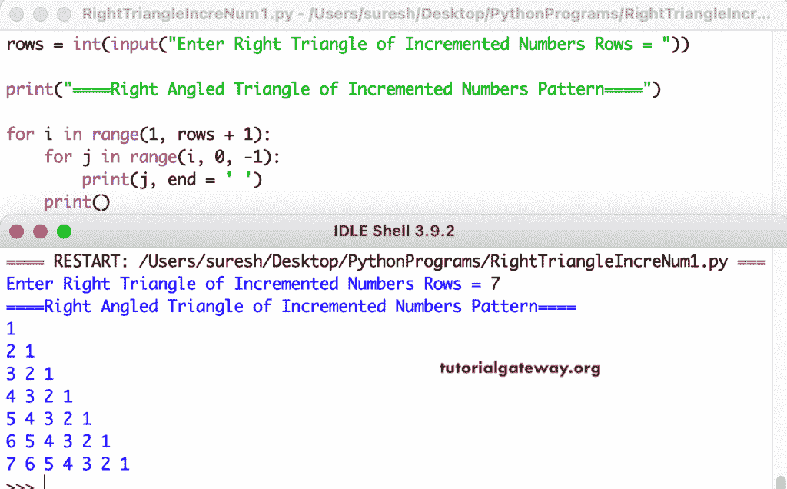

# Python 程序：打印递增数字的直角三角形

> 原文：<https://www.tutorialgateway.org/python-program-to-print-right-triangle-of-incremented-numbers/>

编写一个 Python 程序来打印递增数字的直角三角形模式，用于循环。

```py
rows = int(input("Enter Right Triangle of Incremented Numbers Rows = "))

print("====Right Angled Triangle of Incremented Numbers Pattern====")

for i in range(1, rows + 1):
    for j in range(i, 0, -1):
        print(j, end = ' ') 
    print()
```



这个 [python 示例](https://www.tutorialgateway.org/python-programming-examples/)使用 while 循环以直角三角形模式打印递增的数字。

```py
rows = int(input("Enter Right Triangle of Incremented Numbers Rows = "))

print("====Right Angled Triangle of Incremented Numbers Pattern====")
i = 1
while(i <= rows):
    j = i
    while(j >= 1):
        print(j, end = ' ')
        j = j - 1
    print()
    i = i + 1
```

```py
Enter Right Triangle of Incremented Numbers Rows = 12
====Right Angled Triangle of Incremented Numbers Pattern====
1 
2 1 
3 2 1 
4 3 2 1 
5 4 3 2 1 
6 5 4 3 2 1 
7 6 5 4 3 2 1 
8 7 6 5 4 3 2 1 
9 8 7 6 5 4 3 2 1 
10 9 8 7 6 5 4 3 2 1 
11 10 9 8 7 6 5 4 3 2 1 
12 11 10 9 8 7 6 5 4 3 2 1 
```