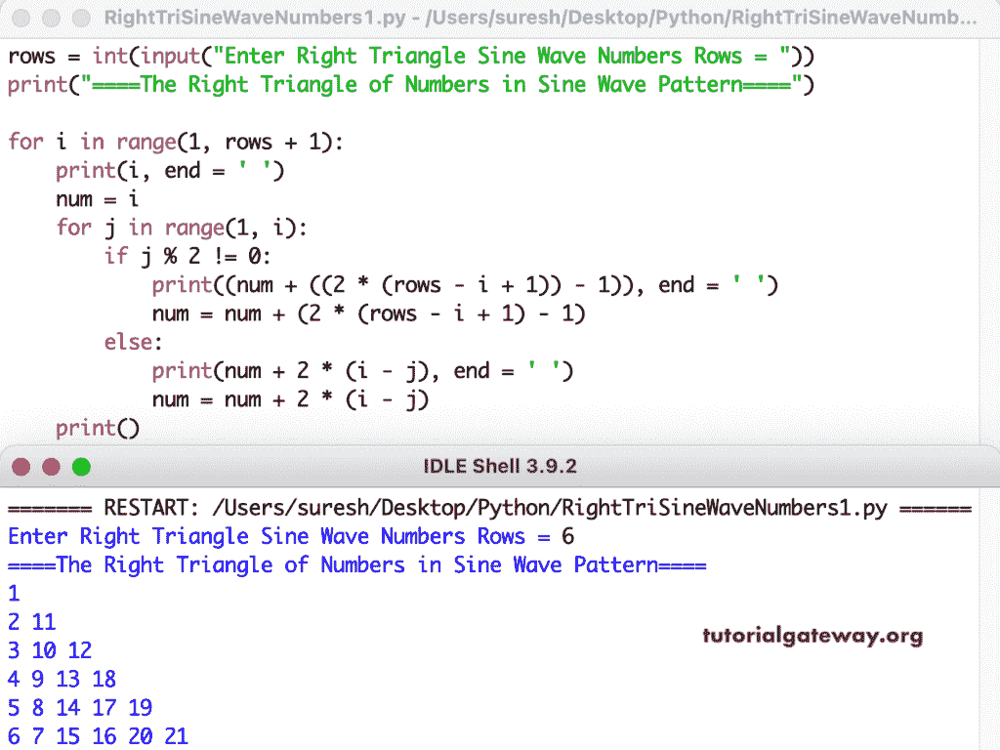

# Python 程序：打印数字的正弦波直角三角形

> 原文：<https://www.tutorialgateway.org/python-program-to-print-right-triangle-of-numbers-in-sine-wave-pattern/>

编写一个 Python 程序，使用 for 循环以正弦波模式打印数字的直角三角形。

```py
rows = int(input("Enter Right Triangle Sine Wave Numbers Rows = "))

print("====The Right Triangle of Numbers in Sine Wave Pattern====")

for i in range(1, rows + 1):
    print(i, end = ' ')
    num = i
    for j in range(1, i):
        if j % 2 != 0:
            print((num + ((2 * (rows - i + 1)) - 1)), end = ' ')
            num = num + (2 * (rows - i + 1) - 1)
        else:
            print(num + 2 * (i - j), end = ' ')
            num = num + 2 * (i - j)
    print()
```



编写 python 程序的另一种方法是以直角三角形的形式显示数字的正弦波模式。

```py
rows = int(input("Enter Right Triangle Sine Wave Numbers Rows = "))

print("====The Right Triangle of Numbers in Sine Wave Pattern====")

for i in range(rows):
    for j in range(i + 1):
        if j % 2 == 0:
            print(int(1 + j * rows - (j - 1) * j / 2  + i - j), end = ' ')
        else:
            print(int(1 + j * rows - (j - 1) * j / 2  + rows - i - 1), end = ' ')
    print()
```

```py
Enter Right Triangle Sine Wave Numbers Rows = 9
====The Right Triangle of Numbers in Sine Wave Pattern====
1 
2 17 
3 16 18 
4 15 19 30 
5 14 20 29 31 
6 13 21 28 32 39 
7 12 22 27 33 38 40 
8 11 23 26 34 37 41 44 
9 10 24 25 35 36 42 43 45 
```

这个 [Python 示例](https://www.tutorialgateway.org/python-programming-examples/)使用 while 循环以正弦波格式打印数字的直角三角形图案。

```py
rows = int(input("Enter Right Triangle Sine Wave Numbers Rows = "))

print("====The Right Triangle of Numbers in Sine Wave Pattern====")
i = 0
while(i < rows):
    j = 0
    while(j <= i):
        x = 1 + j * rows - (j - 1) * j / 2
        if j % 2 == 0:
            print(int(x + i - j), end = ' ')
        else:
            print(int(x + rows - i - 1), end = ' ')
        j = j + 1
    print()
    i = i + 1
```

```py
Enter Right Triangle Sine Wave Numbers Rows = 13
====The Right Triangle of Numbers in Sine Wave Pattern====
1 
2 25 
3 24 26 
4 23 27 46 
5 22 28 45 47 
6 21 29 44 48 63 
7 20 30 43 49 62 64 
8 19 31 42 50 61 65 76 
9 18 32 41 51 60 66 75 77 
10 17 33 40 52 59 67 74 78 85 
11 16 34 39 53 58 68 73 79 84 86 
12 15 35 38 54 57 69 72 80 83 87 90 
13 14 36 37 55 56 70 71 81 82 88 89 91
```