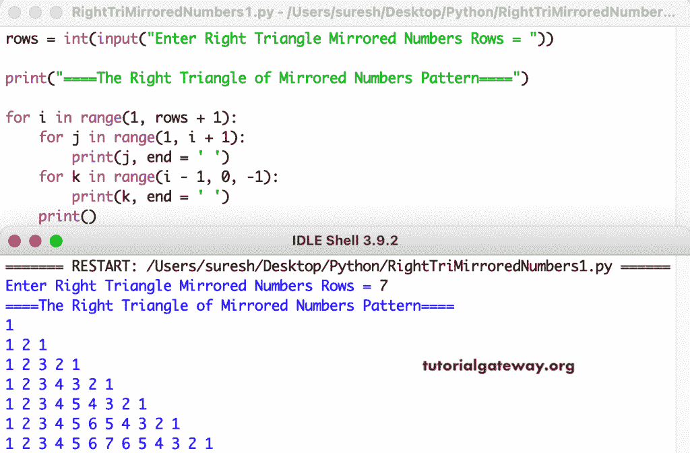

# Python 程序：打印数字的镜像直角三角形图案

> 原文：<https://www.tutorialgateway.org/python-program-to-print-right-triangle-of-mirrored-numbers-pattern/>

编写一个 Python 程序，使用 for 循环打印镜像数字图案的直角三角形。

```py
rows = int(input("Enter Right Triangle Mirrored Numbers Rows = "))

print("====The Right Triangle of Mirrored Numbers Pattern====")

for i in range(1, rows + 1):
    for j in range(1, i + 1):
        print(j, end = ' ')
    for k in range(i - 1, 0, -1):
        print(k, end = ' ')
    print()
```



这个 [Python 示例](https://www.tutorialgateway.org/python-programming-examples/)使用 while 循环打印镜像数字的直角三角形模式。

```py
rows = int(input("Enter Right Triangle Mirrored Numbers Rows = "))

print("====The Right Triangle of Mirrored Numbers Pattern====")
i = 1

while(i <= rows):
    j = 1
    while(j <= i):
        print(j, end = ' ')
        j = j + 1
    k = i - 1
    while(k >= 1):
        print(k, end = ' ')
        k = k - 1
    print()
    i = i + 1
```

```py
Enter Right Triangle Mirrored Numbers Rows = 12
====The Right Triangle of Mirrored Numbers Pattern====
1 
1 2 1 
1 2 3 2 1 
1 2 3 4 3 2 1 
1 2 3 4 5 4 3 2 1 
1 2 3 4 5 6 5 4 3 2 1 
1 2 3 4 5 6 7 6 5 4 3 2 1 
1 2 3 4 5 6 7 8 7 6 5 4 3 2 1 
1 2 3 4 5 6 7 8 9 8 7 6 5 4 3 2 1 
1 2 3 4 5 6 7 8 9 10 9 8 7 6 5 4 3 2 1 
1 2 3 4 5 6 7 8 9 10 11 10 9 8 7 6 5 4 3 2 1 
1 2 3 4 5 6 7 8 9 10 11 12 11 10 9 8 7 6 5 4 3 2 1 
```