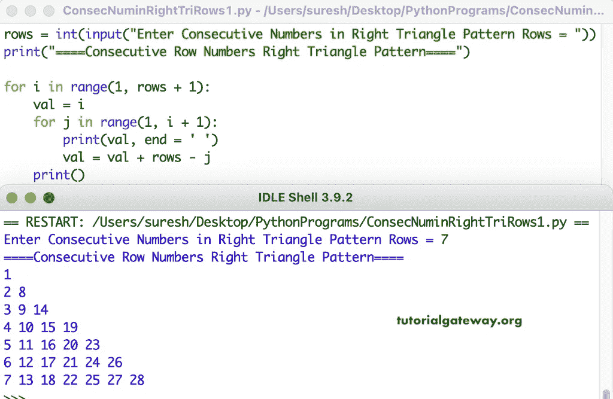

# Python 程序：打印直角三角形行数字连续

> 原文：<https://www.tutorialgateway.org/python-program-to-print-consecutive-rows-numbers-in-right-triangle/>

编写一个 Python 程序，使用 for 循环以直角三角形模式打印连续的行数字。

```py
rows = int(input("Enter Consecutive Numbers in Right Triangle Pattern Rows = "))

print("====Consecutive Row Numbers Right Triangle Pattern====")

for i in range(1, rows + 1):
    val = i
    for j in range(1, i + 1):
        print(val, end = ' ')
        val = val + rows - j
    print()
```



这个 [Python 示例](https://www.tutorialgateway.org/python-programming-examples/)使用 while 循环打印行数字连续的直角三角形模式。

```py
rows = int(input("Enter Consecutive Numbers in Right Triangle Pattern Rows = "))

print("====Consecutive Row Numbers Right Triangle Pattern====")

i = 1

while(i <= rows):
    val = i
    j = 1
    while(j <= i):
        print(val, end = ' ')
        val = val + rows - j
        j = j + 1
    print()
    i = i + 1
```

```py
Enter Consecutive Numbers in Right Triangle Pattern Rows = 12
====Consecutive Row Numbers Right Triangle Pattern====
1 
2 13 
3 14 24 
4 15 25 34 
5 16 26 35 43 
6 17 27 36 44 51 
7 18 28 37 45 52 58 
8 19 29 38 46 53 59 64 
9 20 30 39 47 54 60 65 69 
10 21 31 40 48 55 61 66 70 73 
11 22 32 41 49 56 62 67 71 74 76 
12 23 33 42 50 57 63 68 72 75 77 78 
```