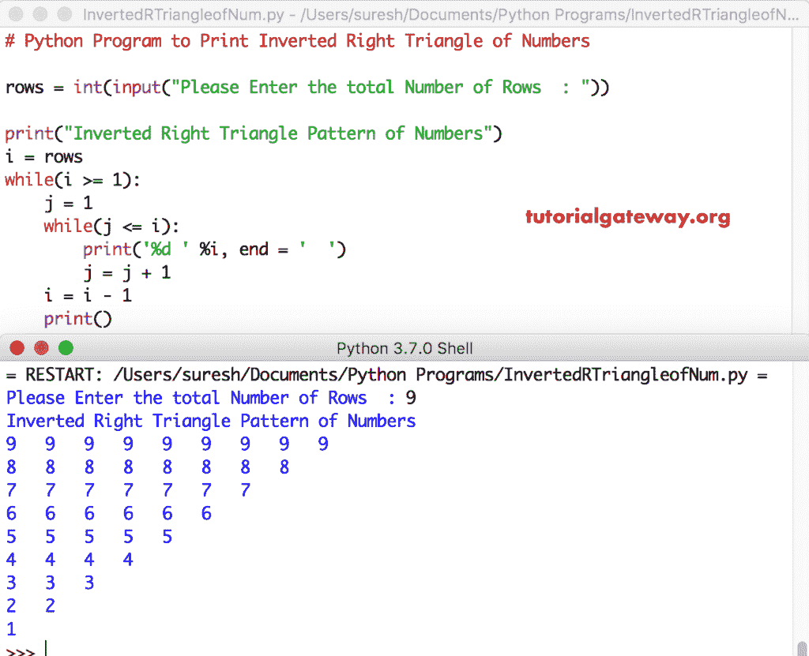

# Python 程序：打印倒直角三角形数字

> 原文：<https://www.tutorialgateway.org/python-program-to-print-inverted-right-triangle-of-numbers/>

写一个 Python 程序，用 For 循环和 While 循环打印数字的倒直角三角形，并举例说明。

## 使用 For 循环打印倒直角三角形数字的 Python 程序

这个 Python 程序允许用户输入总行数。接下来，我们使用 Python While 循环和 For 循环来打印从最大值到 1 的倒直角三角形数字。

```py
# Python Program to Print Inverted Right Triangle of Numbers

rows = int(input("Please Enter the total Number of Rows  : "))

print("Inverted Right Triangle Pattern of Numbers") 
i = rows
while(i >= 1):
    for j in range(1, i + 1):      
        print('%d ' %i, end = '  ')
    i = i - 1
    print()
```

```py
Please Enter the total Number of Rows  : 12
Inverted Right Triangle Pattern of Numbers
12   12   12   12   12   12   12   12   12   12   12   12   
11   11   11   11   11   11   11   11   11   11   11   
10   10   10   10   10   10   10   10   10   10   
9   9   9   9   9   9   9   9   9   
8   8   8   8   8   8   8   8   
7   7   7   7   7   7   7   
6   6   6   6   6   6   
5   5   5   5   5   
4   4   4   4   
3   3   3   
2   2   
1   
>>> 
```

## 使用 While 循环的 Python 倒直角三角形程序

本 [Python](https://www.tutorialgateway.org/python-tutorial/) 倒直角三角形程序同上。然而，在这个 [Python 程序](https://www.tutorialgateway.org/python-programming-examples/)中，我们将 [For Loop](https://www.tutorialgateway.org/python-for-loop/) 替换为 [While Loop](https://www.tutorialgateway.org/python-while-loop/)

```py
# Python Program to Print Inverted Right Triangle of Numbers

rows = int(input("Please Enter the total Number of Rows  : "))

print("Inverted Right Triangle Pattern of Numbers") 
i = rows
while(i >= 1):
    j = 1
    while(j <= i):      
        print('%d ' %i, end = '  ')
        j = j + 1
    i = i - 1
    print()
```

